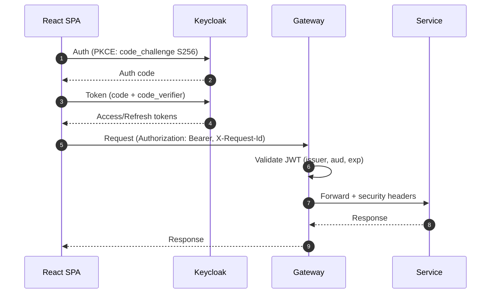
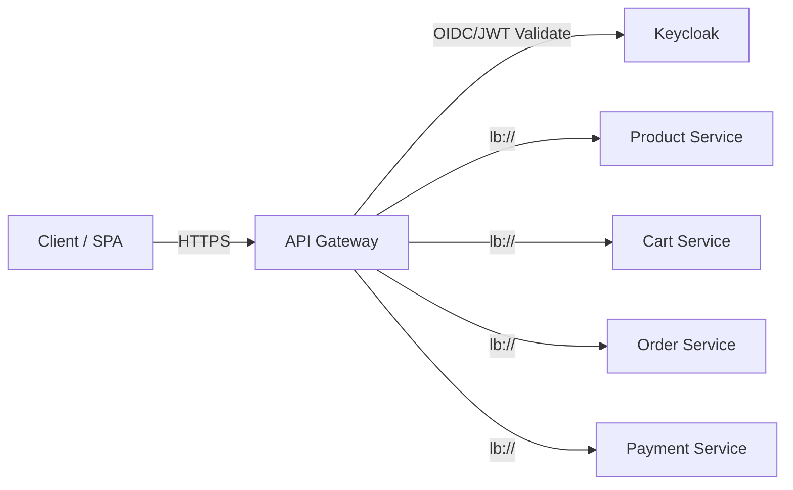
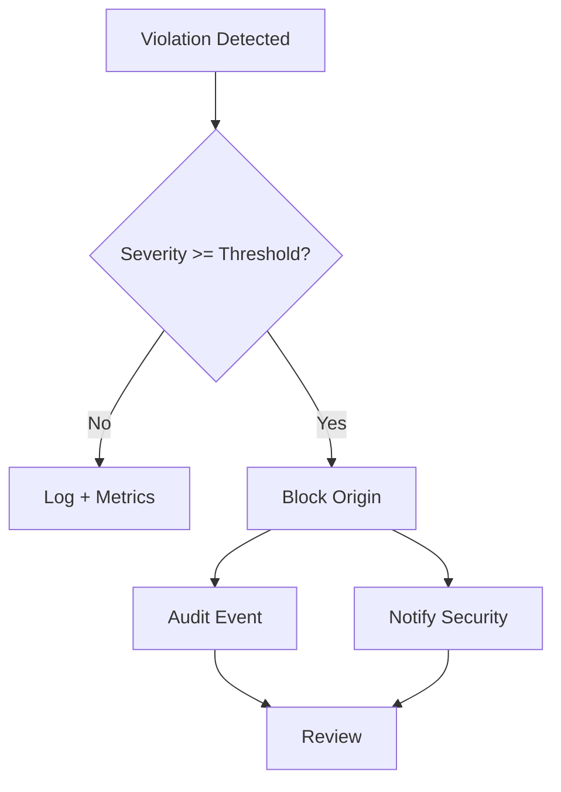

# Diagram Style Guide

## Purpose

Consistent, interview-ready diagrams using Mermaid across interview notes and implementation logs.

## Conventions

- Titles: short and action-oriented
- Actors/nodes: stable names (`SPA`, `GW`, `KC`, `OrderSvc`, `PaymentSvc`)
- Always include `X-Request-Id` when relevant to flows
- Prefer:
  - sequenceDiagram for request/response flows
  - graph LR/TD for component and data flows
  - flowchart for decision trees/incident flows
  - stateDiagram for lifecycles
- Keep labels minimal; move details to surrounding text

## Templates

### Sequence (HTTP + Auth)

### Component (Gateway Security Perimeter)

### Flow (Incident Escalation)

