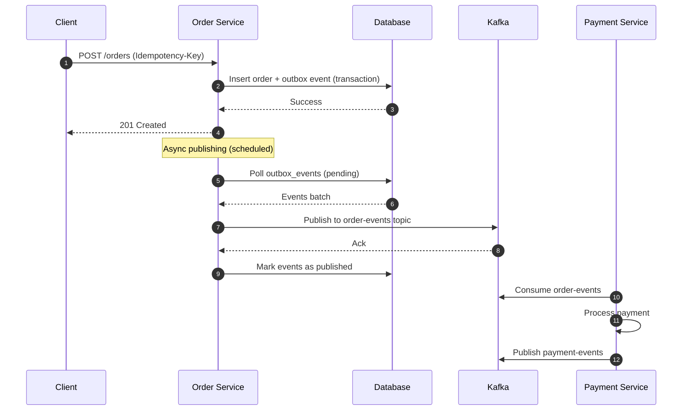

# Outbox Configuration

## Overview

The order service uses an outbox pattern to ensure reliable event publishing to Kafka. Events are stored in the database first and then published asynchronously by a scheduled task.

## Configuration

### Order → Kafka → Payment Service Flow



### Enable/Disable Outbox Publishing

The outbox publishing can be controlled via the `ecommerce.outbox.enabled` property:

```yaml
ecommerce:
  outbox:
    enabled: true  # Set to false to disable outbox publishing
    poll-interval-ms: 1000
    batch-size: 100
```

### Disabling for Testing

To disable outbox publishing during tests or development:

1. **Application Properties**: Set `ecommerce.outbox.enabled=false` in your `application.yml` or `application-test.yml`
2. **Environment Variable**: Set `ECOMMERCE_OUTBOX_ENABLED=false`
3. **Command Line**: Add `--ecommerce.outbox.enabled=false` to your startup command

When disabled:
- The scheduled `publishPendingEvents()` method will skip execution
- The scheduled `cleanupOldEvents()` method will skip execution
- Events will still be stored in the `outbox_events` table but won't be published
- This is useful for integration tests where you want to control event publishing manually

### Idempotency Key Usage

The order service uses the `idem_keys` table to enforce idempotency for order creation:

- Each order creation request must include an `Idempotency-Key` header
- The same key returns the original result for 24 hours
- This prevents duplicate order creation in case of network retries or client retries

### Database Schema

The outbox pattern uses the following tables:

- `outbox_events`: Stores events pending publication
- `idem_keys`: Stores idempotency keys to prevent duplicate processing

### Monitoring

The outbox publisher provides statistics via the `getOutboxStats()` method:
- Pending events count
- Retry events count  
- Failed events count

These can be exposed via actuator endpoints for monitoring.
