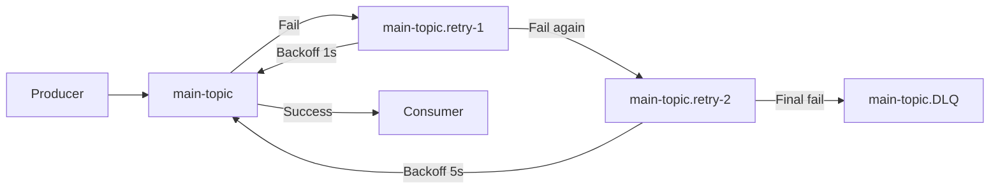

# Resilience4j Implementation Guide

## Overview

This document describes the Resilience4j implementation across the Mambogo e-commerce microservices to provide fault tolerance and resilience for outbound HTTP calls.

## Architecture

The implementation uses Resilience4j with the following patterns:
- **TimeLimiter**: Prevents calls from hanging indefinitely
- **Retry**: Automatically retries failed calls with exponential backoff
- **CircuitBreaker**: Prevents cascading failures by temporarily stopping calls to failing services

## Configuration

### Kafka Retry Topic Flow



### Resilience4j Settings

All services use the same `outbound` instance configuration:

```yaml
resilience4j:
  timelimiter:
    instances:
      outbound:
        timeoutDuration: 3s
  retry:
    instances:
      outbound:
        maxRetryAttempts: 3
        waitDuration: 500ms
        enableExponentialBackoff: true
        exponentialBackoffMultiplier: 2.0
        randomizedWait: true
        retryExceptions:
          - java.io.IOException
          - org.springframework.web.reactive.function.client.WebClientRequestException
        ignoreExceptions:
          - org.springframework.web.reactive.function.client.WebClientResponseException$BadRequest
  circuitbreaker:
    instances:
      outbound:
        slidingWindowSize: 20
        minimumNumberOfCalls: 10
        failureRateThreshold: 50
        waitDurationInOpenState: 10s
        permittedNumberOfCallsInHalfOpenState: 3
        automaticTransitionFromOpenToHalfOpenEnabled: true
```

### Configuration Parameters

| Parameter | Value | Description |
|-----------|-------|-------------|
| `timeoutDuration` | 3s | Maximum time to wait for a response |
| `maxRetryAttempts` | 3 | Number of retry attempts |
| `waitDuration` | 500ms | Initial wait time between retries |
| `exponentialBackoffMultiplier` | 2.0 | Multiplier for exponential backoff |
| `randomizedWait` | true | Adds jitter to prevent thundering herd |
| `slidingWindowSize` | 20 | Number of calls to track for circuit breaker |
| `minimumNumberOfCalls` | 10 | Minimum calls before circuit breaker activates |
| `failureRateThreshold` | 50 | Percentage of failures to trigger circuit breaker |
| `waitDurationInOpenState` | 10s | Time to wait before trying half-open state |
| `permittedNumberOfCallsInHalfOpenState` | 3 | Number of test calls in half-open state |

## Implementation Details

### Services with Resilience4j

1. **Order Service**
   - Calls Payment Service for payment processing
   - Calls Product Service for inventory reservation
   - Fallback: Returns `PAYMENT_DEFERRED` or `RESERVATION_PENDING` status

2. **Payment Service**
   - Calls external PSP (Payment Service Provider)
   - Fallback: Returns `FAILED` status with error message

3. **Product Service**
   - Calls external inventory systems
   - Fallback: Returns `UNAVAILABLE` status

### HTTP Clients

All services use WebClient with correlation ID forwarding:

```java
@Configuration
public class WebClientConfig {
    @Bean
    public WebClient webClient() {
        return WebClient.builder()
                .filter((request, next) -> {
                    String correlationId = MDC.get("X-Correlation-Id");
                    if (correlationId != null && !correlationId.isEmpty()) {
                        return next.exchange(ClientRequest.from(request)
                                .header("X-Correlation-Id", correlationId)
                                .build());
                    }
                    return next.exchange(request);
                })
                .build();
    }
}
```

### Annotated Methods

All outbound HTTP calls use the same Resilience4j annotations:

```java
@TimeLimiter(name = "outbound")
@Retry(name = "outbound")
@CircuitBreaker(name = "outbound", fallbackMethod = "methodNameFallback")
public CompletableFuture<ResponseType> methodName(RequestType request) {
    // HTTP call implementation
}
```

## Fallback Behavior

### Order Service Fallbacks

**Payment Service Failure:**
- Status: `PAYMENT_DEFERRED`
- Order Status: `PENDING_PAYMENT`
- Transaction ID: `FALLBACK-{timestamp}`

**Inventory Service Failure:**
- Status: `RESERVATION_PENDING`
- Items: Marked as unavailable
- Expiration: 30 minutes from creation

### Payment Service Fallbacks

**External PSP Failure:**
- Status: `FAILED`
- Message: "Payment service temporarily unavailable"
- Transaction ID: `FALLBACK-{timestamp}`

### Product Service Fallbacks

**External Inventory Failure:**
- Status: `UNAVAILABLE`
- Message: "External inventory service temporarily unavailable"
- Products: Marked as unknown availability

## Observability

### Logging

Resilience4j logging is enabled at INFO level:
```yaml
logging:
  level:
    io.github.resilience4j: INFO
```

### Tracing

- Zipkin traces include outbound HTTP attempts
- Correlation IDs are preserved across service calls
- Circuit breaker state changes are logged

### Metrics

Resilience4j provides metrics for:
- Circuit breaker state transitions
- Retry attempts and successes
- Timeout occurrences
- Fallback method invocations

## Testing

### Unit Tests

Test fallback methods and error scenarios:
```bash
# Run unit tests
mvn test -Dtest=*ClientTest
```

### Integration Tests

Test with unavailable services:
```bash
# Run integration tests
mvn test -Dtest=*IntegrationTest
```

### Manual Testing

1. **Test Circuit Breaker:**
   ```bash
   # Stop payment service
   docker-compose stop payment-service
   
   # Make order requests - should get PAYMENT_DEFERRED
   curl -X POST http://localhost:8084/orders
   
   # Check logs for circuit breaker state changes
   docker-compose logs order-service | grep -i circuit
   ```

2. **Test Retry Logic:**
   ```bash
   # Simulate intermittent failures
   # Check logs for retry attempts
   docker-compose logs order-service | grep -i retry
   ```

3. **Test Timeout:**
   ```bash
   # Configure slow response from payment service
   # Verify 3-second timeout is enforced
   ```

## Monitoring and Alerting

### Key Metrics to Monitor

1. **Circuit Breaker State**
   - CLOSED → OPEN transitions
   - OPEN → HALF_OPEN transitions
   - HALF_OPEN → CLOSED transitions

2. **Retry Statistics**
   - Retry attempts per service
   - Success rate after retries

3. **Timeout Occurrences**
   - Number of timeouts per service
   - Average response times

4. **Fallback Invocations**
   - Frequency of fallback method calls
   - Impact on business metrics

### Alerting Rules

```yaml
# Example Prometheus alerting rules
groups:
  - name: resilience4j
    rules:
      - alert: CircuitBreakerOpen
        expr: circuitbreaker_state{state="OPEN"} > 0
        for: 1m
        labels:
          severity: warning
        annotations:
          summary: "Circuit breaker is OPEN for {{ $labels.instance }}"
          
      - alert: HighFallbackRate
        expr: rate(fallback_calls_total[5m]) > 0.1
        for: 2m
        labels:
          severity: critical
        annotations:
          summary: "High fallback rate detected"
```

## Troubleshooting

### Common Issues

1. **Circuit Breaker Not Opening**
   - Check `minimumNumberOfCalls` configuration
   - Verify `failureRateThreshold` is appropriate
   - Ensure exceptions are not in `ignoreExceptions`

2. **Retries Not Working**
   - Verify exception types in `retryExceptions`
   - Check `maxRetryAttempts` configuration
   - Ensure exponential backoff is enabled

3. **Timeouts Too Frequent**
   - Increase `timeoutDuration` if service is legitimately slow
   - Check network connectivity
   - Verify service health

### Debug Commands

```bash
# Check circuit breaker state
curl http://localhost:8084/actuator/health

# View Resilience4j metrics
curl http://localhost:8084/actuator/metrics/resilience4j.circuitbreaker.calls

# Check service logs
docker-compose logs -f order-service | grep -E "(resilience4j|circuit|retry|timeout)"
```

## Performance Considerations

### Memory Usage

- Circuit breaker state is stored in memory
- Retry attempts may consume additional memory
- Monitor heap usage during high failure rates

### Network Impact

- Retries increase network traffic
- Exponential backoff reduces thundering herd
- Consider rate limiting for external services

### Database Impact

- Fallback responses may require database updates
- Ensure idempotency for retry scenarios
- Monitor database connection pool usage

## Best Practices

1. **Configure Appropriately**
   - Set realistic timeout values
   - Adjust retry attempts based on service characteristics
   - Tune circuit breaker thresholds for your failure patterns

2. **Monitor and Alert**
   - Set up comprehensive monitoring
   - Create alerts for circuit breaker state changes
   - Track business impact of fallbacks

3. **Test Thoroughly**
   - Test all failure scenarios
   - Verify fallback behavior
   - Load test with circuit breaker enabled

4. **Document Fallbacks**
   - Clearly document fallback behavior
   - Train operations team on fallback scenarios
   - Create runbooks for common issues

## Future Enhancements

1. **Bulkhead Pattern**
   - Implement thread pool isolation
   - Separate circuit breakers for different service tiers

2. **Rate Limiting**
   - Add rate limiting for external services
   - Implement adaptive rate limiting

3. **Advanced Fallbacks**
   - Implement cascading fallbacks
   - Add business logic to fallback methods
   - Implement graceful degradation

4. **Observability Improvements**
   - Add custom metrics for business impact
   - Implement distributed tracing
   - Create dashboards for resilience metrics
