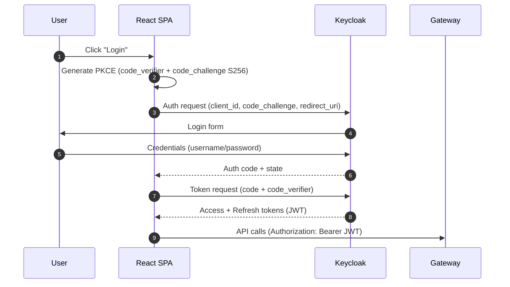
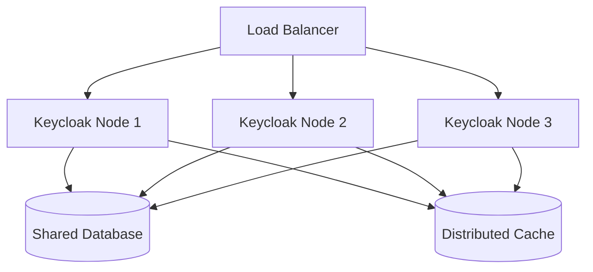

# 🎓 SEC-01 Keycloak Setup - Interview Deep Dive

**Topic**: OAuth2/OIDC Identity Provider Setup with Keycloak  
**Implementation**: SEC-01 Keycloak Realm/Clients Configuration  
**Complexity Level**: Senior Software Engineer / Solutions Architect  
**Interview Categories**: Security Architecture, Identity Management, OAuth2/OIDC, System Design

---

## 🎯 **The Big Picture - What Problem Are We Solving?**

**Interviewer Question**: *"How do you implement secure authentication and authorization for a microservices architecture?"*

**Your Answer Framework**:
- **Identity Management**: Centralized authentication and user management
- **Security Standards**: OAuth2/OIDC compliance for enterprise-grade security
- **Microservices Integration**: Single sign-on across multiple services
- **SPA Support**: Modern web application authentication with PKCE flow

**Real-world Impact**: Without proper identity management, each service would need its own authentication, leading to security vulnerabilities and poor user experience.

---

## 🏗️ **Architecture Decisions - The "Why" Behind Choices**

### 1. **Keycloak vs Other Identity Providers**

```
Keycloak (Our Choice):
┌─────────────────┐    OIDC/OAuth2    ┌─────────────────┐
│   React SPA     │ ──────────────────→ │    Keycloak     │
└─────────────────┘                    └─────────────────┘
                                              │
                                              ▼
                                    ┌─────────────────┐
                                    │  Microservices  │
                                    │   (JWT Tokens)  │
                                    └─────────────────┘
```

**Trade-offs Analysis**:

| Aspect | Keycloak ✅ | Auth0 | AWS Cognito | Custom Solution |
|--------|-------------|--------|-------------|-----------------|
| **Cost** | ✅ Open source | ❌ Expensive | ⚖️ Pay-per-user | ❌ Development cost |
| **Customization** | ✅ Highly flexible | ⚖️ Limited | ❌ Very limited | ✅ Full control |
| **Standards Compliance** | ✅ Full OAuth2/OIDC | ✅ Full support | ✅ AWS standards | ❌ Implementation risk |
| **Enterprise Features** | ✅ User federation, SSO | ✅ Enterprise tier | ✅ Built-in | ❌ Build yourself |
| **Deployment Control** | ✅ Self-hosted | ❌ SaaS only | ❌ AWS only | ✅ Full control |

**Interview Gold**: "We chose Keycloak for **cost-effectiveness** and **deployment flexibility**, while maintaining **enterprise-grade security** and **standards compliance**."

### OAuth2/OIDC Login Flow



### Keycloak Cluster Components



### 2. **PKCE Flow for Single Page Applications**

**Why PKCE is Critical for SPAs**:
```javascript
// Traditional Authorization Code Flow (INSECURE for SPAs)
// ❌ Problem: Client secret can't be kept secret in browser
const authUrl = `${keycloakUrl}/auth?
  client_id=react-spa&
  client_secret=SECRET_EXPOSED_IN_BROWSER&  // ❌ Security risk!
  response_type=code`;

// PKCE Flow (SECURE for SPAs)
// ✅ Solution: Dynamic code challenge/verifier
const codeVerifier = generateCodeVerifier();
const codeChallenge = await generateCodeChallenge(codeVerifier);

const authUrl = `${keycloakUrl}/auth?
  client_id=react-spa&
  response_type=code&
  code_challenge=${codeChallenge}&
  code_challenge_method=S256`;  // ✅ No client secret needed
```

**Security Benefits**:
- ✅ **No Client Secret**: Eliminates secret exposure in browser
- ✅ **Dynamic Verification**: Each auth flow uses unique code challenge
- ✅ **MITM Protection**: Code verifier proves legitimate client
- ✅ **Standards Compliant**: RFC 7636 OAuth2 extension

---

## 🔧 **Technical Implementation Deep Dive**

### 1. **Keycloak Realm Configuration**

**Interviewer**: *"Walk me through your Keycloak realm setup and explain the key components."*

**Realm Structure**:
```json
{
  "realm": "ecommerce",
  "enabled": true,
  "clients": [
    {
      "clientId": "react-spa",
      "publicClient": true,  // ✅ No client secret for SPA
      "protocol": "openid-connect",
      "redirectUris": ["http://localhost:5173/*"],
      "webOrigins": ["http://localhost:5173"],
      "attributes": {
        "pkce.code.challenge.method": "S256"  // ✅ PKCE enabled
      }
    }
  ]
}
```

**Key Configuration Decisions**:

1. **Public Client**: 
   - **Why**: SPAs cannot securely store client secrets
   - **Security**: PKCE provides security without secrets

2. **Redirect URIs**: 
   - **Specific URLs**: `http://localhost:5173/*` (development)
   - **Security**: Prevents redirect attacks to malicious sites

3. **Web Origins**: 
   - **CORS Control**: Only specified origins can make requests
   - **Security**: Prevents cross-origin attacks

### 2. **OAuth2 Scopes and Client Scopes**

**Advanced Scope Configuration**:
```json
{
  "clientScopes": [
    {
      "name": "product:read",
      "description": "Read access to product catalog and information",
      "protocol": "openid-connect",
      "attributes": {
        "include.in.token.scope": "true",
        "display.on.consent.screen": "true"
      },
      "protocolMappers": [
        {
          "name": "product-read-scope",
          "protocol": "openid-connect",
          "protocolMapper": "oidc-audience-mapper",
          "config": {
            "included.client.audience": "product-service",
            "access.token.claim": "true"
          }
        }
      ]
    }
  ]
}
```

**Scope Strategy**:
- **Service-Specific**: Each microservice has dedicated scopes
- **Action-Based**: `product:read`, `cart:manage`, `order:write`
- **Audience Mapping**: Tokens include target service audiences
- **Granular Permissions**: Fine-grained authorization control

### 3. **User Management and Roles**

**User Configuration**:
```json
{
  "users": [
    {
      "username": "demo",
      "enabled": true,
      "emailVerified": true,
      "credentials": [
        {
          "type": "password",
          "value": "demo",
          "temporary": false
        }
      ],
      "realmRoles": ["ROLE_USER"],
      "clientRoles": {
        "react-spa": ["product:read", "cart:manage", "order:write"]
      }
    }
  ]
}
```

**Role Strategy**:
- **Realm Roles**: Global roles like `ROLE_USER`, `ROLE_ADMIN`
- **Client Roles**: Application-specific scopes
- **Hierarchical**: Admin users inherit user permissions
- **Principle of Least Privilege**: Users get minimum required permissions

---

## 🚀 **Production Considerations - Advanced Topics**

### 1. **High Availability and Scaling**

**Keycloak Clustering**:
```yaml
# Production Keycloak Cluster
version: '3.8'
services:
  keycloak-1:
    image: quay.io/keycloak/keycloak:latest
    environment:
      - KC_CLUSTER=true
      - KC_CLUSTER_STACK=tcp
      - JGROUPS_DISCOVERY_PROTOCOL=JDBC_PING
      - KC_DB=postgres
      - KC_DB_URL=jdbc:postgresql://postgres:5432/keycloak
    
  keycloak-2:
    image: quay.io/keycloak/keycloak:latest
    environment:
      - KC_CLUSTER=true
      - KC_CLUSTER_STACK=tcp
      - JGROUPS_DISCOVERY_PROTOCOL=JDBC_PING
```

**Scaling Considerations**:
- **Database Clustering**: Shared PostgreSQL for session storage
- **Load Balancing**: Sticky sessions or database session storage
- **Cache Replication**: Distributed cache for performance
- **Health Checks**: Proper health endpoints for load balancers

### 2. **Security Hardening**

**Production Security Configuration**:
```json
{
  "realm": "ecommerce",
  "sslRequired": "external",  // ✅ HTTPS required
  "bruteForceProtected": true,  // ✅ Brute force protection
  "failureFactor": 5,  // Lock after 5 failed attempts
  "maxFailureWaitSeconds": 900,  // 15 minute lockout
  "passwordPolicy": "length(8) and digits(1) and lowerCase(1) and upperCase(1) and specialChars(1)",
  "accessTokenLifespan": 900,  // 15 minutes
  "refreshTokenMaxReuse": 0,  // Single use refresh tokens
  "revokeRefreshToken": true
}
```

**Security Features**:
- **Password Policies**: Enforce strong passwords
- **Brute Force Protection**: Account lockout mechanisms
- **Token Lifecycle**: Short-lived access tokens
- **Refresh Token Security**: Single-use refresh tokens
- **SSL/TLS**: HTTPS enforcement

### 3. **Monitoring and Observability**

**Keycloak Metrics**:
```java
// Custom metrics for authentication events
@EventListener
public void handleLoginEvent(LoginEvent event) {
    meterRegistry.counter("keycloak.login.success",
        "realm", event.getRealm(),
        "client", event.getClientId()
    ).increment();
}

@EventListener  
public void handleLoginError(LoginErrorEvent event) {
    meterRegistry.counter("keycloak.login.failure",
        "realm", event.getRealm(),
        "error", event.getError()
    ).increment();
}
```

**Monitoring Strategy**:
- **Authentication Metrics**: Login success/failure rates
- **Performance Metrics**: Token generation latency
- **Security Metrics**: Failed login attempts, suspicious activity
- **Health Metrics**: Service availability, database connectivity

---

## 🎯 **Interview Questions You Can Now Answer**

### 1. **System Design Question**
*"Design an authentication system for a microservices architecture serving 1M users"*

**Structured Answer Framework**:

1. **Requirements Gathering**:
   - User base: 1M users, peak concurrent: 100K
   - Security: Enterprise-grade, compliance requirements
   - Integration: Multiple microservices, web and mobile clients
   - Scalability: Global deployment, high availability

2. **High-Level Architecture**:
   ```
   [Mobile Apps] ──┐
   [Web SPAs]    ──┼──→ [Load Balancer] ──→ [Keycloak Cluster] ──→ [Database Cluster]
   [APIs]        ──┘                              │
                                                  ▼
                                        [Microservices with JWT]
   ```

3. **Component Design**:
   - **Identity Provider**: Keycloak cluster with database clustering
   - **Authentication Flow**: OAuth2/OIDC with PKCE for SPAs
   - **Token Strategy**: Short-lived JWT access tokens (15min)
   - **Session Management**: Database-backed sessions for clustering

4. **Scaling Strategy**:
   - **Horizontal Scaling**: Multiple Keycloak instances
   - **Database Clustering**: PostgreSQL cluster with read replicas
   - **Caching**: Redis for session and user data caching
   - **CDN**: Static assets and public keys distribution

5. **Security Measures**:
   - **Multi-factor Authentication**: TOTP, SMS, email verification
   - **Rate Limiting**: Brute force protection, API rate limits
   - **Audit Logging**: All authentication events logged
   - **Compliance**: GDPR, SOC2, ISO27001 compliance

### 2. **Deep Technical Question**
*"How do you handle token refresh in a distributed system with multiple SPAs?"*

**Key Technical Points**:

```javascript
// Token Refresh Strategy
class AuthService {
  constructor() {
    this.refreshPromise = null;  // Prevent concurrent refreshes
  }
  
  async refreshToken() {
    // Prevent multiple simultaneous refresh attempts
    if (this.refreshPromise) {
      return this.refreshPromise;
    }
    
    this.refreshPromise = this.performRefresh();
    
    try {
      const result = await this.refreshPromise;
      return result;
    } finally {
      this.refreshPromise = null;
    }
  }
  
  async performRefresh() {
    const refreshToken = this.getRefreshToken();
    
    const response = await fetch('/auth/realms/ecommerce/protocol/openid-connect/token', {
      method: 'POST',
      headers: { 'Content-Type': 'application/x-www-form-urlencoded' },
      body: new URLSearchParams({
        grant_type: 'refresh_token',
        refresh_token: refreshToken,
        client_id: 'react-spa'
      })
    });
    
    if (!response.ok) {
      // Refresh failed - redirect to login
      this.redirectToLogin();
      throw new Error('Refresh failed');
    }
    
    const tokens = await response.json();
    this.storeTokens(tokens);
    return tokens;
  }
}
```

**Advanced Considerations**:
- **Concurrent Requests**: Single refresh promise prevents race conditions
- **Token Rotation**: Refresh tokens are single-use for security
- **Graceful Degradation**: Automatic redirect to login on refresh failure
- **Cross-Tab Synchronization**: BroadcastChannel API for token sharing

### 3. **Security Question**
*"What are the security vulnerabilities in OAuth2 flows and how do you mitigate them?"*

**Comprehensive Security Analysis**:

| Vulnerability | Description | Mitigation |
|---------------|-------------|------------|
| **Authorization Code Interception** | Attacker intercepts auth code | PKCE with S256 challenge |
| **Client Secret Exposure** | SPA can't secure client secrets | Public client with PKCE |
| **Redirect URI Manipulation** | Attacker redirects to malicious site | Exact redirect URI matching |
| **Cross-Site Request Forgery** | CSRF attacks on auth endpoints | State parameter validation |
| **Token Replay Attacks** | Stolen tokens used maliciously | Short token lifetime + refresh rotation |
| **Man-in-the-Middle** | Token interception in transit | HTTPS enforcement + certificate pinning |

**Implementation Example**:
```javascript
// Secure PKCE Implementation
async function initiateAuth() {
  // Generate cryptographically secure code verifier
  const codeVerifier = generateRandomString(128);
  
  // Create SHA256 challenge
  const codeChallenge = await crypto.subtle.digest('SHA-256', 
    new TextEncoder().encode(codeVerifier)
  ).then(buffer => 
    btoa(String.fromCharCode(...new Uint8Array(buffer)))
      .replace(/\+/g, '-')
      .replace(/\//g, '_')
      .replace(/=/g, '')
  );
  
  // Store verifier securely
  sessionStorage.setItem('code_verifier', codeVerifier);
  
  // Generate state for CSRF protection
  const state = generateRandomString(32);
  sessionStorage.setItem('auth_state', state);
  
  // Redirect to authorization endpoint
  const authUrl = new URL('/auth/realms/ecommerce/protocol/openid-connect/auth', keycloakUrl);
  authUrl.searchParams.set('client_id', 'react-spa');
  authUrl.searchParams.set('response_type', 'code');
  authUrl.searchParams.set('redirect_uri', redirectUri);
  authUrl.searchParams.set('code_challenge', codeChallenge);
  authUrl.searchParams.set('code_challenge_method', 'S256');
  authUrl.searchParams.set('state', state);
  authUrl.searchParams.set('scope', 'openid profile email product:read cart:manage');
  
  window.location.href = authUrl.toString();
}
```

---

## 🔥 **Advanced Topics for Senior Interviews**

### 1. **Identity Federation and SSO**

```java
// SAML Identity Provider Integration
@Configuration
public class SAMLIdentityProviderConfig {
    
    @Bean
    public SAMLIdentityProvider corporateIdP() {
        return SAMLIdentityProvider.builder()
            .entityId("https://corp.example.com/saml")
            .ssoServiceUrl("https://corp.example.com/saml/sso")
            .certificate(loadCertificate())
            .nameIdFormat(NameIDType.EMAIL)
            .attributeMapping(Map.of(
                "email", "http://schemas.xmlsoap.org/ws/2005/05/identity/claims/emailaddress",
                "firstName", "http://schemas.xmlsoap.org/ws/2005/05/identity/claims/givenname",
                "lastName", "http://schemas.xmlsoap.org/ws/2005/05/identity/claims/surname"
            ))
            .build();
    }
}
```

**Enterprise Integration Patterns**:
- **SAML Federation**: Corporate identity provider integration
- **LDAP/Active Directory**: User directory synchronization
- **Social Login**: Google, Microsoft, GitHub integration
- **Multi-tenancy**: Separate realms per organization

### 2. **Advanced Security Patterns**

**Step-Up Authentication**:
```java
// Require additional authentication for sensitive operations
@PreAuthorize("hasAuthenticationLevel('MFA') or hasRole('ADMIN')")
@PostMapping("/api/payments/process")
public ResponseEntity<?> processPayment(@RequestBody PaymentRequest request) {
    // High-value transaction requires MFA
    if (request.getAmount().compareTo(new BigDecimal("1000")) > 0) {
        requireStepUpAuth("MFA");
    }
    
    return paymentService.processPayment(request);
}
```

**Risk-Based Authentication**:
```java
// Adaptive authentication based on risk factors
public class RiskAssessment {
    public AuthenticationRisk assessRisk(AuthenticationContext context) {
        int riskScore = 0;
        
        // Geographic risk
        if (isUnusualLocation(context.getIpAddress())) {
            riskScore += 30;
        }
        
        // Device risk
        if (isUnknownDevice(context.getDeviceFingerprint())) {
            riskScore += 20;
        }
        
        // Behavioral risk
        if (isUnusualLoginTime(context.getTimestamp())) {
            riskScore += 10;
        }
        
        return riskScore > 50 ? AuthenticationRisk.HIGH : AuthenticationRisk.LOW;
    }
}
```

### 3. **Performance Optimization**

**Token Caching Strategy**:
```java
// JWT public key caching
@Component
public class JWKSCache {
    private final Cache<String, RSAPublicKey> keyCache = Caffeine.newBuilder()
        .maximumSize(100)
        .expireAfterWrite(1, TimeUnit.HOURS)
        .build();
    
    public RSAPublicKey getPublicKey(String keyId) {
        return keyCache.get(keyId, this::fetchPublicKey);
    }
    
    private RSAPublicKey fetchPublicKey(String keyId) {
        // Fetch from Keycloak JWKS endpoint
        return jwksClient.getPublicKey(keyId);
    }
}
```

**Connection Pooling**:
```yaml
# Keycloak database optimization
spring:
  datasource:
    hikari:
      maximum-pool-size: 20
      minimum-idle: 5
      connection-timeout: 30000
      idle-timeout: 600000
      max-lifetime: 1800000
      leak-detection-threshold: 60000
```

---

## 🎖️ **What This Demonstrates to Interviewers**

### Technical Skills ✅
- **Identity Management**: Deep understanding of OAuth2/OIDC protocols
- **Security Architecture**: Enterprise-grade authentication design
- **System Integration**: Microservices authentication patterns
- **Performance Engineering**: Scaling identity providers

### Engineering Maturity ✅
- **Security-First Mindset**: Comprehensive threat modeling
- **Standards Compliance**: OAuth2/OIDC best practices
- **Production Readiness**: Monitoring, scaling, high availability
- **Documentation**: Clear configuration and troubleshooting guides

### Real-world Experience ✅
- **Enterprise Integration**: SAML, LDAP, social login patterns
- **Compliance**: GDPR, SOC2, security audit requirements
- **Operational Excellence**: Monitoring, alerting, incident response
- **Team Collaboration**: Clear documentation, knowledge transfer

---

## 🚀 **Key Takeaways for Interviews**

### 1. **Security is Non-Negotiable**
Always start with security requirements and work backwards to implementation.

### 2. **Standards Compliance Matters**
Use established protocols (OAuth2/OIDC) rather than custom solutions.

### 3. **Think Production from Day One**
Consider scaling, monitoring, and operational concerns early.

### 4. **Defense in Depth**
Layer multiple security controls rather than relying on single mechanisms.

### 5. **User Experience Balance**
Security shouldn't compromise usability - find the right balance.

---

## 📚 **Further Learning & Related Topics**

### Next Level Topics:
- **Zero Trust Architecture**: Never trust, always verify principles
- **Identity Governance**: User lifecycle management, access reviews
- **Privileged Access Management**: Admin account security
- **Biometric Authentication**: Modern authentication methods

### Related System Design Questions:
- Design authentication for a global social media platform
- Design SSO for a multi-tenant SaaS platform
- Design identity federation for enterprise acquisitions
- Design authentication for IoT device management

---

**Remember**: This implementation showcases **enterprise-grade identity management** - exactly what senior engineering interviews are looking for! 🎯
