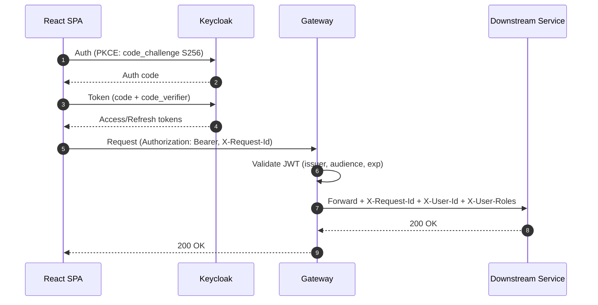
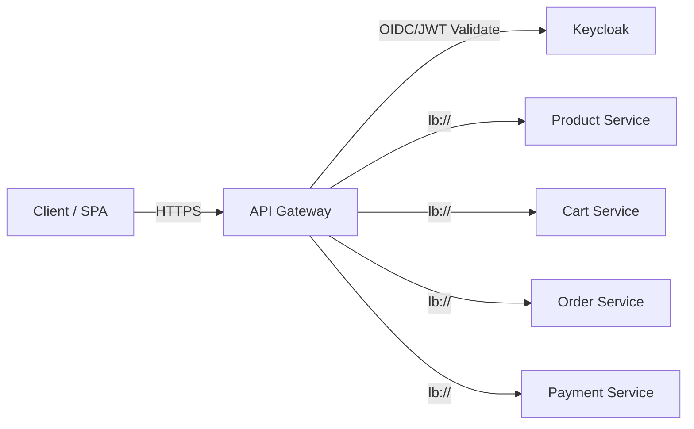

# 🎓 SEC-02 Gateway OIDC + JWT Validation - Interview Deep Dive

**Topic**: API Gateway Security with OAuth2/OIDC and JWT Validation  
**Implementation**: SEC-02 Gateway OIDC + JWT Validation  
**Complexity Level**: Senior Software Engineer / Solutions Architect  
**Interview Categories**: API Gateway, Distributed Security, JWT, System Design

---

## 🎯 **The Big Picture - What Problem Are We Solving?**

**Interviewer Question**: *"How do you implement centralized authentication and authorization in a microservices architecture?"*

**Your Answer Framework**:
- **Single Entry Point**: API Gateway as security perimeter
- **Token Validation**: Centralized JWT validation and user context extraction
- **Service Protection**: Shield downstream services from authentication complexity
- **Consistent Security**: Uniform security policies across all microservices

**Real-world Impact**: Without gateway-level security, each microservice would need to implement authentication, leading to inconsistency, security gaps, and increased complexity.

---

## 🏗️ **Architecture Decisions - The "Why" Behind Choices**

### 1. **Gateway-Level vs Service-Level Authentication**

```
Gateway-Level Security (Our Choice):
┌─────────────┐    JWT Validation    ┌─────────────┐    User Context    ┌─────────────┐
│   Client    │ ──────────────────→ │   Gateway   │ ──────────────────→ │ Microservice│
└─────────────┘                     └─────────────┘                     └─────────────┘
                                           │
                                           ▼
                                    ┌─────────────┐
                                    │  Keycloak   │
                                    │ (Validation)│
                                    └─────────────┘

Service-Level Alternative:
┌─────────────┐                     ┌─────────────┐    JWT Validation   ┌─────────────┐
│   Client    │ ──────────────────→ │   Gateway   │ ──────────────────→ │ Microservice│
└─────────────┘                     └─────────────┘                     └─────────────┘
                                                                               │
                                                                               ▼
                                                                        ┌─────────────┐
                                                                        │  Keycloak   │
                                                                        └─────────────┘
```

**Trade-offs Analysis**:

| Aspect | Gateway-Level ✅ | Service-Level |
|--------|------------------|---------------|
| **Performance** | ✅ Single validation per request | ❌ Multiple validations per request |
| **Consistency** | ✅ Uniform security policies | ❌ Potential policy drift |
| **Complexity** | ✅ Centralized configuration | ❌ Distributed configuration |
| **Network Efficiency** | ✅ Reduced external calls | ❌ Multiple Keycloak calls |
| **Service Autonomy** | ❌ Centralized dependency | ✅ Independent security |
| **Failure Impact** | ❌ Single point of failure | ✅ Isolated failures |

**Interview Gold**: "We chose gateway-level for **performance** and **consistency**, but mitigated the single point of failure with **high availability** and **graceful degradation**."

### 2. **JWT Token Propagation Strategy**

**Challenge**: How do downstream services access user information without re-validating JWT?

```java
// Token Propagation Filter
@Component
public class JwtPropagationFilter implements GlobalFilter {
    
    @Override
    public Mono<Void> filter(ServerWebExchange exchange, GatewayFilterChain chain) {
        return exchange.getPrincipal()
            .cast(JwtAuthenticationToken.class)
            .flatMap(token -> {
                // Extract user information from JWT
                Jwt jwt = token.getToken();
                String userId = jwt.getSubject();
                String username = jwt.getClaimAsString("preferred_username");
                List<String> roles = extractRoles(jwt);
                
                // Propagate as headers
                ServerHttpRequest request = exchange.getRequest().mutate()
                    .header("X-JWT-Token", jwt.getTokenValue())
                    .header("X-User-Id", userId)
                    .header("X-Username", username)
                    .header("X-User-Roles", String.join(",", roles))
                    .header("X-Authenticated", "true")
                    .build();
                
                return chain.filter(exchange.mutate().request(request).build());
            })
            .onErrorResume(error -> {
                // Handle unauthenticated requests
                ServerHttpRequest request = exchange.getRequest().mutate()
                    .header("X-Authenticated", "false")
                    .build();
                
                return chain.filter(exchange.mutate().request(request).build());
            });
    }
}
```

**Benefits of Header Propagation**:
- ✅ **Performance**: Services don't need to decode JWT
- ✅ **Simplicity**: Plain HTTP headers, no JWT libraries needed
- ✅ **Flexibility**: Services can choose which user data to use
- ✅ **Debugging**: Easy to inspect in logs and monitoring

---

## 🖼️ PKCE + Gateway Request Flow (Sequence)



## 🧱 Gateway Security Perimeter (Components)



---

## 🔧 **Technical Implementation Deep Dive**

### 1. **Spring Security OAuth2 Resource Server Configuration**

**Interviewer**: *"Walk me through your JWT validation configuration and explain the key components."*

```java
@Configuration
@EnableWebFluxSecurity
public class SecurityConfig {
    
    @Bean
    public SecurityWebFilterChain springSecurityFilterChain(ServerHttpSecurity http) {
        return http
            .csrf(csrf -> csrf.disable())  // Stateless API
            .sessionManagement(session -> 
                session.sessionCreationPolicy(SessionCreationPolicy.STATELESS))
            
            // Route-based authorization
            .authorizeExchange(exchanges -> exchanges
                // Public endpoints
                .pathMatchers("/actuator/**").permitAll()
                .pathMatchers("/api/catalog/**").permitAll()
                .pathMatchers("/api/products/**").permitAll()
                
                // Secured endpoints with role requirements
                .pathMatchers("/api/cart/**").hasRole("USER")
                .pathMatchers("/api/orders/**").hasRole("USER")
                .pathMatchers("/api/payments/**").hasRole("USER")
                
                // Admin endpoints
                .pathMatchers("/api/admin/**").hasRole("ADMIN")
                
                .anyExchange().authenticated()
            )
            
            // OAuth2 Resource Server with JWT
            .oauth2ResourceServer(oauth2 -> oauth2
                .jwt(jwt -> jwt
                    .jwtAuthenticationConverter(jwtAuthenticationConverter())
                )
            )
            
            // Custom error handling
            .exceptionHandling(exceptions -> exceptions
                .authenticationEntryPoint(customAuthenticationEntryPoint())
                .accessDeniedHandler(customAccessDeniedHandler())
            )
            
            // CORS configuration
            .cors(cors -> cors.configurationSource(corsConfigurationSource()))
            
            .build();
    }
}
```

**Key Configuration Decisions**:

1. **Stateless Sessions**: 
   - **Why**: JWT tokens contain all necessary information
   - **Benefit**: Horizontal scalability, no session storage

2. **Route-Based Authorization**: 
   - **Why**: Different endpoints have different security requirements
   - **Benefit**: Fine-grained access control

3. **Custom Error Handling**: 
   - **Why**: Consistent error responses across all services
   - **Benefit**: Better client experience, easier debugging

### 2. **JWT Authentication Converter**

```java
@Bean
public Converter<Jwt, Mono<AbstractAuthenticationToken>> jwtAuthenticationConverter() {
    JwtGrantedAuthoritiesConverter authoritiesConverter = new JwtGrantedAuthoritiesConverter();
    authoritiesConverter.setAuthoritiesClaimName("realm_access.roles");
    authoritiesConverter.setAuthorityPrefix("ROLE_");
    
    return jwt -> {
        Collection<GrantedAuthority> authorities = authoritiesConverter.convert(jwt);
        return Mono.just(new JwtAuthenticationToken(jwt, authorities));
    };
}
```

**Role Extraction Strategy**:
```json
// JWT Payload Structure
{
  "sub": "user-123",
  "preferred_username": "demo",
  "realm_access": {
    "roles": ["USER", "ADMIN"]  // ← Extracted here
  },
  "scope": "product:read cart:manage",
  "aud": ["product-service", "cart-service"],
  "iss": "http://localhost:8081/realms/ecommerce",
  "exp": 1642684260
}
```

### 3. **Custom Error Handling**

**Authentication Entry Point (401 Unauthorized)**:
```java
@Component
public class CustomAuthenticationEntryPoint implements ServerAuthenticationEntryPoint {
    
    @Override
    public Mono<Void> commence(ServerWebExchange exchange, AuthenticationException ex) {
        ServerHttpResponse response = exchange.getResponse();
        response.setStatusCode(HttpStatus.UNAUTHORIZED);
        response.getHeaders().add("Content-Type", "application/json");
        
        ErrorResponse errorResponse = ErrorResponse.builder()
            .code("AUTHENTICATION_FAILED")
            .message("Authentication required")
            .timestamp(Instant.now())
            .path(exchange.getRequest().getPath().value())
            .service("gateway-service")
            .build();
        
        DataBuffer buffer = response.bufferFactory()
            .wrap(objectMapper.writeValueAsBytes(errorResponse));
        
        return response.writeWith(Mono.just(buffer));
    }
}
```

**Access Denied Handler (403 Forbidden)**:
```java
@Component
public class CustomAccessDeniedHandler implements ServerAccessDeniedHandler {
    
    @Override
    public Mono<Void> handle(ServerWebExchange exchange, AccessDeniedException denied) {
        ServerHttpResponse response = exchange.getResponse();
        response.setStatusCode(HttpStatus.FORBIDDEN);
        response.getHeaders().add("Content-Type", "application/json");
        
        ErrorResponse errorResponse = ErrorResponse.builder()
            .code("ACCESS_DENIED")
            .message("Insufficient permissions")
            .timestamp(Instant.now())
            .path(exchange.getRequest().getPath().value())
            .service("gateway-service")
            .build();
        
        DataBuffer buffer = response.bufferFactory()
            .wrap(objectMapper.writeValueAsBytes(errorResponse));
        
        return response.writeWith(Mono.just(buffer));
    }
}
```

**Structured Error Response**:
```json
{
  "code": "AUTHENTICATION_FAILED",
  "message": "Authentication required",
  "timestamp": "2025-01-20T10:30:00Z",
  "path": "/api/cart",
  "service": "gateway-service"
}
```

---

## 🚀 **Production Considerations - Advanced Topics**

### 1. **Performance Optimization**

**JWT Validation Caching**:
```java
@Configuration
public class JwtDecoderConfig {
    
    @Bean
    public ReactiveJwtDecoder jwtDecoder() {
        String jwkSetUri = keycloakProperties.getJwkSetUri();
        
        NimbusReactiveJwtDecoder jwtDecoder = NimbusReactiveJwtDecoder
            .withJwkSetUri(jwkSetUri)
            .cache(Duration.ofMinutes(5))  // Cache JWK for 5 minutes
            .build();
        
        // Custom JWT validation
        jwtDecoder.setJwtValidator(jwtValidator());
        
        return jwtDecoder;
    }
    
    @Bean
    public Converter<Jwt, Mono<JwtValidationResult>> jwtValidator() {
        List<Converter<Jwt, JwtValidationResult>> validators = Arrays.asList(
            new JwtTimestampValidator(),
            new JwtIssuerValidator(keycloakProperties.getIssuer()),
            new JwtAudienceValidator(keycloakProperties.getAudience())
        );
        
        return new DelegatingConverter<>(validators);
    }
}
```

**Connection Pooling**:
```yaml
spring:
  security:
    oauth2:
      resourceserver:
        jwt:
          issuer-uri: ${KC_ISSUER:http://localhost:8081/realms/ecommerce}
          # Connection pool settings
          connection-timeout: 5000
          read-timeout: 10000
          max-connections: 50
```

### 2. **High Availability and Resilience**

**Circuit Breaker for JWT Validation**:
```java
@Component
public class ResilientJwtValidator {
    
    private final CircuitBreaker circuitBreaker;
    
    public ResilientJwtValidator() {
        this.circuitBreaker = CircuitBreaker.ofDefaults("jwt-validation");
        circuitBreaker.getEventPublisher()
            .onStateTransition(event -> 
                log.warn("JWT validation circuit breaker state transition: {}", event));
    }
    
    public Mono<JwtValidationResult> validate(Jwt jwt) {
        return Mono.fromCallable(() -> circuitBreaker.executeCallable(() -> {
            // Perform JWT validation
            return performValidation(jwt);
        }))
        .onErrorResume(CircuitBreakerOpenException.class, ex -> {
            // Circuit breaker is open - use cached validation or fail gracefully
            log.warn("JWT validation circuit breaker is open, using fallback");
            return handleCircuitBreakerOpen(jwt);
        });
    }
}
```

**Graceful Degradation**:
```java
// Fallback strategy when Keycloak is unavailable
public Mono<JwtValidationResult> handleCircuitBreakerOpen(Jwt jwt) {
    // Option 1: Use cached public keys for offline validation
    if (hasValidCachedKey(jwt.getKeyId())) {
        return validateWithCachedKey(jwt);
    }
    
    // Option 2: Allow requests with warning (emergency mode)
    if (isEmergencyModeEnabled()) {
        log.warn("Emergency mode: Allowing request without full JWT validation");
        return Mono.just(JwtValidationResult.success());
    }
    
    // Option 3: Fail securely
    return Mono.just(JwtValidationResult.failure("JWT validation unavailable"));
}
```

### 3. **Monitoring and Observability**

**Security Metrics**:
```java
@Component
public class SecurityMetrics {
    
    private final MeterRegistry meterRegistry;
    private final Counter authSuccessCounter;
    private final Counter authFailureCounter;
    private final Timer jwtValidationTimer;
    
    public SecurityMetrics(MeterRegistry meterRegistry) {
        this.meterRegistry = meterRegistry;
        this.authSuccessCounter = Counter.builder("gateway.auth.success")
            .description("Successful authentications")
            .register(meterRegistry);
        this.authFailureCounter = Counter.builder("gateway.auth.failure")
            .description("Failed authentications")
            .tag("reason", "invalid_token")
            .register(meterRegistry);
        this.jwtValidationTimer = Timer.builder("gateway.jwt.validation.duration")
            .description("JWT validation time")
            .register(meterRegistry);
    }
    
    public void recordAuthSuccess(String userId, String clientId) {
        authSuccessCounter.increment(
            Tags.of(
                Tag.of("user_id", userId),
                Tag.of("client_id", clientId)
            )
        );
    }
    
    public void recordJwtValidation(Duration duration) {
        jwtValidationTimer.record(duration);
    }
}
```

**Security Event Logging**:
```java
@EventListener
public void handleAuthenticationSuccess(AuthenticationSuccessEvent event) {
    JwtAuthenticationToken token = (JwtAuthenticationToken) event.getAuthentication();
    String userId = token.getToken().getSubject();
    String clientIp = extractClientIp(event);
    
    log.info("Authentication successful - User: {}, IP: {}, Timestamp: {}", 
        userId, clientIp, Instant.now());
    
    // Send to security monitoring system
    securityMonitor.recordAuthEvent(AuthEvent.builder()
        .type("AUTH_SUCCESS")
        .userId(userId)
        .clientIp(clientIp)
        .timestamp(Instant.now())
        .build());
}
```

---

## 🎯 **Interview Questions You Can Now Answer**

### 1. **System Design Question**
*"Design the security layer for an API Gateway serving 100K requests per second"*

**Structured Answer Framework**:

1. **Requirements Analysis**:
   - Traffic: 100K RPS, peak 200K RPS
   - Latency: <10ms security overhead
   - Availability: 99.99% uptime
   - Security: Enterprise-grade JWT validation

2. **High-Level Architecture**:
   ```
   [Load Balancer] → [Gateway Cluster] → [JWT Cache] → [Keycloak Cluster]
                           │
                           ▼
                    [Microservices]
   ```

3. **Performance Optimizations**:
   - **JWT Caching**: Redis cache for decoded JWTs (5-minute TTL)
   - **Public Key Caching**: Cache Keycloak public keys locally
   - **Connection Pooling**: Persistent connections to Keycloak
   - **Async Validation**: Non-blocking JWT validation

4. **Scaling Strategy**:
   - **Horizontal Scaling**: Multiple gateway instances
   - **Load Balancing**: Round-robin with health checks
   - **Circuit Breakers**: Protect against Keycloak failures
   - **Graceful Degradation**: Cached validation fallback

5. **Monitoring & Alerting**:
   - **Metrics**: Authentication success/failure rates
   - **Latency**: JWT validation response times
   - **Errors**: Circuit breaker state, validation failures
   - **Security**: Suspicious authentication patterns

### 2. **Deep Technical Question**
*"How do you handle JWT token expiration and refresh in a gateway architecture?"*

**Comprehensive Answer**:

```java
// Token Refresh Handling Strategy
@Component
public class TokenRefreshHandler {
    
    public Mono<ServerResponse> handleExpiredToken(ServerRequest request) {
        return extractRefreshToken(request)
            .flatMap(this::refreshAccessToken)
            .flatMap(newTokens -> {
                // Update response with new tokens
                return ServerResponse.ok()
                    .header("Authorization", "Bearer " + newTokens.getAccessToken())
                    .cookie(ResponseCookie.from("refresh_token", newTokens.getRefreshToken())
                        .httpOnly(true)
                        .secure(true)
                        .sameSite("Strict")
                        .maxAge(Duration.ofDays(7))
                        .build())
                    .build();
            })
            .onErrorResume(RefreshTokenExpiredException.class, ex -> {
                // Refresh token expired - require re-authentication
                return ServerResponse.status(HttpStatus.UNAUTHORIZED)
                    .header("WWW-Authenticate", "Bearer error=\"invalid_token\"")
                    .bodyValue(ErrorResponse.builder()
                        .code("REFRESH_TOKEN_EXPIRED")
                        .message("Please re-authenticate")
                        .build());
            });
    }
    
    private Mono<TokenResponse> refreshAccessToken(String refreshToken) {
        return webClient.post()
            .uri("/auth/realms/ecommerce/protocol/openid-connect/token")
            .contentType(MediaType.APPLICATION_FORM_URLENCODED)
            .bodyValue(BodyInserters.fromFormData("grant_type", "refresh_token")
                .with("refresh_token", refreshToken)
                .with("client_id", "react-spa"))
            .retrieve()
            .bodyToMono(TokenResponse.class)
            .timeout(Duration.ofSeconds(5))
            .retry(2);
    }
}
```

**Token Lifecycle Management**:
- **Proactive Refresh**: Refresh tokens before expiration (80% of lifetime)
- **Graceful Handling**: Return 401 with refresh instructions
- **Security**: Rotate refresh tokens on each use
- **Monitoring**: Track token refresh patterns for anomaly detection

### 3. **Security Deep Dive Question**
*"What are the security considerations when propagating user context to microservices?"*

**Security Analysis**:

| Security Concern | Risk | Mitigation |
|------------------|------|------------|
| **Header Injection** | Malicious clients inject fake headers | Sanitize/overwrite security headers |
| **Token Exposure** | JWT tokens visible in logs/traces | Use opaque tokens or encrypt headers |
| **Man-in-the-Middle** | Headers intercepted in transit | TLS encryption, service mesh |
| **Service Impersonation** | Malicious service uses headers | mTLS, service authentication |
| **Information Leakage** | Sensitive data in headers | Minimal user context, encryption |

**Secure Implementation**:
```java
@Component
public class SecureHeaderPropagation {
    
    private static final Set<String> SECURITY_HEADERS = Set.of(
        "X-JWT-Token", "X-User-Id", "X-Username", "X-User-Roles"
    );
    
    public ServerHttpRequest propagateSecureHeaders(ServerHttpRequest request, Jwt jwt) {
        // Remove any existing security headers (prevent injection)
        ServerHttpRequest.Builder builder = request.mutate();
        SECURITY_HEADERS.forEach(header -> builder.headers(headers -> headers.remove(header)));
        
        // Add validated security headers
        return builder
            .header("X-User-Id", jwt.getSubject())
            .header("X-Username", jwt.getClaimAsString("preferred_username"))
            .header("X-User-Roles", extractRoles(jwt))
            .header("X-Service-Auth", generateServiceToken())  // Service-to-service auth
            .header("X-Request-Id", generateRequestId())       // Request tracing
            .build();
    }
    
    private String generateServiceToken() {
        // Generate short-lived token for service-to-service communication
        return jwtEncoder.encode(JwtClaimsSet.builder()
            .issuer("gateway-service")
            .audience("microservices")
            .expiresAt(Instant.now().plusSeconds(60))
            .claim("service", "gateway")
            .build()).getTokenValue();
    }
}
```

---

## 🔥 **Advanced Topics for Senior Interviews**

### 1. **Multi-Tenant Security**

```java
// Tenant-aware JWT validation
@Component
public class MultiTenantJwtValidator {
    
    public Mono<JwtValidationResult> validate(Jwt jwt, String tenantId) {
        // Validate tenant-specific claims
        String jwtTenant = jwt.getClaimAsString("tenant");
        if (!tenantId.equals(jwtTenant)) {
            return Mono.just(JwtValidationResult.failure("Invalid tenant"));
        }
        
        // Use tenant-specific public key
        return getTenantPublicKey(tenantId)
            .flatMap(publicKey -> validateSignature(jwt, publicKey));
    }
    
    private Mono<RSAPublicKey> getTenantPublicKey(String tenantId) {
        return tenantKeyCache.get(tenantId)
            .switchIfEmpty(fetchTenantKey(tenantId));
    }
}
```

### 2. **API Versioning and Security**

```java
// Version-aware security configuration
@Configuration
public class VersionedSecurityConfig {
    
    @Bean
    public SecurityWebFilterChain v1SecurityChain(ServerHttpSecurity http) {
        return http
            .securityMatcher(ServerWebExchangeMatchers.pathMatchers("/api/v1/**"))
            .authorizeExchange(exchanges -> exchanges
                .pathMatchers("/api/v1/products/**").hasRole("USER")
                .pathMatchers("/api/v1/admin/**").hasRole("ADMIN")
            )
            .oauth2ResourceServer(oauth2 -> oauth2.jwt())
            .build();
    }
    
    @Bean
    public SecurityWebFilterChain v2SecurityChain(ServerHttpSecurity http) {
        return http
            .securityMatcher(ServerWebExchangeMatchers.pathMatchers("/api/v2/**"))
            .authorizeExchange(exchanges -> exchanges
                .pathMatchers("/api/v2/products/**").hasAuthority("SCOPE_product:read")
                .pathMatchers("/api/v2/admin/**").hasAuthority("SCOPE_admin:all")
            )
            .oauth2ResourceServer(oauth2 -> oauth2.jwt())
            .build();
    }
}
```

### 3. **Advanced Monitoring and Alerting**

```java
// Security anomaly detection
@Component
public class SecurityAnomalyDetector {
    
    private final SlidingWindowCounter failedAttempts = new SlidingWindowCounter(
        Duration.ofMinutes(5), 10);
    
    @EventListener
    public void handleAuthenticationFailure(AuthenticationFailureEvent event) {
        String clientIp = extractClientIp(event);
        
        failedAttempts.increment(clientIp);
        
        if (failedAttempts.getCount(clientIp) > 10) {
            // Potential brute force attack
            alertingService.sendSecurityAlert(SecurityAlert.builder()
                .type("BRUTE_FORCE_DETECTED")
                .clientIp(clientIp)
                .failureCount(failedAttempts.getCount(clientIp))
                .timeWindow(Duration.ofMinutes(5))
                .build());
            
            // Consider rate limiting or blocking
            rateLimitingService.blockIp(clientIp, Duration.ofMinutes(15));
        }
    }
}
```

---

## 🎖️ **What This Demonstrates to Interviewers**

### Technical Skills ✅
- **API Gateway Architecture**: Understanding of centralized security patterns
- **JWT/OAuth2 Expertise**: Deep knowledge of token-based authentication
- **Spring Security**: Advanced configuration and customization
- **Performance Engineering**: Caching, connection pooling, optimization

### Engineering Maturity ✅
- **Security-First Design**: Comprehensive threat modeling and mitigation
- **Production Readiness**: Monitoring, alerting, high availability
- **Error Handling**: Graceful degradation and user-friendly responses
- **Documentation**: Clear implementation and troubleshooting guides

### Real-world Experience ✅
- **Scalability**: Handling high-traffic scenarios
- **Resilience**: Circuit breakers, fallback strategies
- **Observability**: Metrics, logging, security monitoring
- **Team Collaboration**: Clear interfaces, header propagation

---

## 🚀 **Key Takeaways for Interviews**

### 1. **Gateway as Security Perimeter**
Centralize authentication at the gateway for consistency and performance.

### 2. **Token Propagation Strategy**
Design clear interfaces for passing user context to downstream services.

### 3. **Performance Considerations**
Cache JWT validation results and public keys for high-throughput scenarios.

### 4. **Resilience Planning**
Always have fallback strategies for when identity providers are unavailable.

### 5. **Security Monitoring**
Implement comprehensive logging and alerting for security events.

---

## 📚 **Further Learning & Related Topics**

### Next Level Topics:
- **Service Mesh Security**: Istio, Linkerd security features
- **Zero Trust Networking**: Never trust, always verify
- **API Rate Limiting**: Advanced rate limiting strategies
- **Threat Detection**: ML-based anomaly detection

### Related System Design Questions:
- Design authentication for a multi-region API gateway
- Design security for a microservices platform with 1000+ services
- Design token refresh strategy for mobile applications
- Design security monitoring for a high-traffic API platform

---

**Remember**: This implementation showcases **enterprise-grade API gateway security** - exactly what senior engineering interviews are looking for! 🎯
