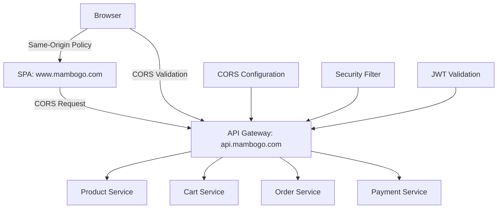

# SEC-06 CORS Configuration - Interview Preparation Guide

**Topic**: Cross-Origin Resource Sharing (CORS) for SPA Integration  
**Implementation**: SEC-06 CORS Configuration for SPA Domain  
**Complexity Level**: Senior Software Engineer / Solutions Architect  
**Interview Focus**: Security, Web Standards, Microservices Integration

---

## 🎯 Interview Overview

This guide covers the CORS implementation for enabling secure cross-origin requests from Single Page Applications (SPAs) to microservices APIs through an API Gateway. The implementation demonstrates deep understanding of web security, browser policies, and production-ready configuration management.

---

## 📚 Technical Deep Dive

### What is CORS and Why is it Critical?

**CORS (Cross-Origin Resource Sharing)** is a security mechanism that allows web applications running on one domain to access resources from another domain. It's a relaxation of the Same-Origin Policy (SOP) that browsers enforce by default.

#### Same-Origin Policy Background
```javascript
// Same Origin (Allowed by default)
Origin: https://www.mambogo.com
Request to: https://www.mambogo.com/api/products ✅

// Cross-Origin (Blocked without CORS)  
Origin: https://www.mambogo.com
Request to: https://api.mambogo.com/products ❌
```

#### CORS Workflow
1. **Simple Requests**: Direct cross-origin requests for safe methods
2. **Preflight Requests**: OPTIONS request sent first for complex requests
3. **Server Response**: Server includes CORS headers indicating permission
4. **Browser Decision**: Browser allows/blocks based on CORS headers

### Real-World Scenario
```
SPA (https://www.mambogo.com) → API Gateway (https://api.mambogo.com) → Microservices
```

Without CORS: Browser blocks all API calls from SPA  
With CORS: Secure, controlled access to backend services

---

## 🏗️ System Design Perspective

### Architecture Overview


### Design Decisions & Trade-offs

#### 1. Gateway-Level vs Service-Level CORS
**Decision**: Implement CORS at API Gateway level  
**Trade-offs**:
- ✅ **Pros**: Centralized configuration, consistent policies, reduced duplication
- ❌ **Cons**: Single point of failure, less service autonomy
- **Rationale**: Better security governance and operational simplicity

#### 2. Static vs Dynamic Origin Validation
**Decision**: Static configuration with environment-specific origins  
**Trade-offs**:
- ✅ **Pros**: Predictable security, better performance, easier auditing
- ❌ **Cons**: Less flexibility, requires deployment for changes
- **Rationale**: Security over convenience for production systems

#### 3. Wildcard vs Explicit Origins
**Decision**: Explicit origins only, no wildcards with credentials  
**Trade-offs**:
- ✅ **Pros**: Maximum security, compliance with security standards
- ❌ **Cons**: More configuration overhead, less developer convenience
- **Rationale**: Security-first approach required for production

---

## 🔒 Security Deep Dive

### CORS Security Vulnerabilities

#### 1. Wildcard Origin with Credentials
```java
// DANGEROUS ❌
configuration.setAllowedOrigins(Arrays.asList("*"));
configuration.setAllowCredentials(true);

// SECURE ✅  
configuration.setAllowedOrigins(Arrays.asList("https://www.mambogo.com"));
configuration.setAllowCredentials(true);
```

**Impact**: Wildcard + credentials allows any origin to make authenticated requests  
**Mitigation**: Explicit origins with validation

#### 2. Origin Reflection Attack
```java
// VULNERABLE ❌
String origin = request.getHeader("Origin");
configuration.setAllowedOrigins(Arrays.asList(origin));

// SECURE ✅
// Only pre-configured origins allowed
```

**Impact**: Attacker can bypass CORS by reflecting their origin  
**Mitigation**: Whitelist-only approach

#### 3. Subdomain Attacks
```java
// RISKY ❌
configuration.setAllowedOrigins(Arrays.asList("*.mambogo.com"));

// SECURE ✅
configuration.setAllowedOrigins(Arrays.asList(
    "https://www.mambogo.com",
    "https://admin.mambogo.com"
));
```

**Impact**: Compromised subdomain can access all APIs  
**Mitigation**: Explicit subdomain listing

### Security Headers Implementation
```java
// Content Security Policy
response.addHeader("Content-Security-Policy", 
    "default-src 'self'; connect-src 'self' https://www.mambogo.com;");

// Additional Protection
response.addHeader("X-Content-Type-Options", "nosniff");
response.addHeader("X-Frame-Options", "DENY");
response.addHeader("X-XSS-Protection", "1; mode=block");
```

---

## 🚀 Production Engineering Considerations

### 1. Performance Optimization

#### Preflight Cache Strategy
```yaml
# Development Environment
max-age: 3600  # 1 hour - frequent changes expected

# Production Environment  
max-age: 7200  # 2 hours - stable configuration
```

**Rationale**: Balance between cache efficiency and configuration flexibility

#### Request Flow Optimization
```java
// Optimized filter ordering
@Order(-100)  // Execute early to fail fast on invalid origins
public class CorsSecurityFilter implements GlobalFilter
```

### 2. Monitoring & Observability

#### Security Event Logging
```java
// Suspicious origin detection
if (isSuspiciousOrigin(origin)) {
    logger.warn("SUSPICIOUS CORS REQUEST - Origin: {}, IP: {}", origin, clientIP);
    // Could trigger security alerts in production
}

// Blocked request tracking
logger.warn("BLOCKED CORS REQUEST - Origin: {}, Endpoint: {}", origin, path);
```

#### Metrics Collection
- CORS request count by origin
- Blocked request rate
- Preflight success rate
- Origin validation latency

### 3. Configuration Management

#### Environment-Specific Configuration
```yaml
# Local Development
allowed-origins:
  - "http://localhost:5173"   # Vite dev server
  - "http://localhost:3000"   # Create React App

# Production
allowed-origins:
  - "https://www.mambogo.com"  # Primary domain
  - "https://mambogo.com"      # Apex domain
```

#### Kubernetes ConfigMap Strategy
```yaml
# Externalized for easy updates without code changes
apiVersion: v1
kind: ConfigMap
metadata:
  name: mambogo-prod-config
data:
  cors-allowed-origins: "https://www.mambogo.com,https://mambogo.com"
```

---

## 🎤 Sample Interview Questions & Structured Answers

### Q1: "Explain how CORS works and why it's necessary for SPAs."

**Structured Answer**:

**Context**: CORS addresses the fundamental security vs usability challenge in web applications.

**Technical Explanation**: 
- Browser Same-Origin Policy blocks cross-origin requests by default
- CORS provides controlled relaxation through server-side headers
- Two-phase process: simple requests vs preflight requests

**SPA Specific Need**:
- Modern SPAs are served from CDNs (different domain from API)
- Need to make authenticated API calls across origins
- Must maintain security while enabling functionality

**Implementation Approach**:
```java
// Configuration validates origins against whitelist
if (corsProperties.getAllowedOrigins().contains(origin)) {
    response.addHeader("Access-Control-Allow-Origin", origin);
    response.addHeader("Access-Control-Allow-Credentials", "true");
}
```

**Production Considerations**:
- Environment-specific origin configuration
- Security monitoring for blocked requests  
- Performance optimization through preflight caching

---

### Q2: "How would you handle CORS in a microservices architecture?"

**Structured Answer**:

**Architecture Decision**: Centralized CORS at API Gateway level

**Rationale**:
- **Consistency**: Single point of policy enforcement
- **Security**: Easier to audit and maintain security standards
- **Performance**: Avoid duplicate processing across services
- **Operational Simplicity**: Single configuration point

**Implementation Strategy**:
```java
// Gateway-level CORS configuration
@Bean
public CorsConfigurationSource corsConfigurationSource() {
    // Centralized configuration for all services
    return source;
}

// Service-level focus on business logic
@RestController
public class ProductController {
    // No CORS concerns - handled by gateway
}
```

**Alternative Approaches**:
- **Service-Level**: Each service handles own CORS (more complex)
- **Proxy-Level**: Web server/load balancer handles CORS (less flexible)

**Trade-offs Discussion**:
- Gateway approach: Better governance, single failure point
- Service approach: More autonomy, configuration complexity
- Chosen approach based on security-first requirements

---

### Q3: "What security vulnerabilities should you avoid when implementing CORS?"

**Structured Answer**:

**Critical Vulnerabilities**:

1. **Wildcard Origins with Credentials**
```java
// DANGEROUS
configuration.setAllowedOrigins(Arrays.asList("*"));
configuration.setAllowCredentials(true);
// Any website can make authenticated requests!
```

2. **Origin Reflection**
```java
// VULNERABLE  
String origin = request.getHeader("Origin");
if (origin != null) {
    response.addHeader("Access-Control-Allow-Origin", origin);
}
// Attacker can bypass by setting their own origin
```

3. **Overly Broad Subdomain Wildcards**
```java
// RISKY
configuration.setAllowedOrigins(Arrays.asList("*.mambogo.com"));
// Compromised subdomain = full API access
```

**Security Implementation**:
```java
// Validation with explicit whitelist
private void validateCorsConfiguration(CorsConfiguration config) {
    if (config.getAllowCredentials() && 
        config.getAllowedOrigins().contains("*")) {
        throw new SecurityException("Wildcard + credentials = security risk");
    }
}
```

**Defense in Depth**:
- Static origin validation
- Security header enforcement  
- Suspicious origin monitoring
- Request logging for audit

---

### Q4: "How do you test CORS configuration effectively?"

**Structured Answer**:

**Multi-Layer Testing Strategy**:

1. **Unit Tests**: Configuration validation
```java
@Test
void shouldRejectWildcardWithCredentials() {
    assertThrows(SecurityException.class, () -> {
        corsProperties.setAllowedOrigins(Arrays.asList("*"));
        corsProperties.setAllowCredentials(true);
        securityConfig.corsConfigurationSource();
    });
}
```

2. **Integration Tests**: Environment-specific scenarios
```bash
# Automated testing script
./scripts/test-cors.sh
# Tests all valid origins, rejects invalid ones
```

3. **Security Tests**: Attack simulation
```bash
# Test with malicious origins
curl -H "Origin: https://evil.com" \
     -X OPTIONS \
     http://api.mambogo.com/products
# Should return 403 or no CORS headers
```

4. **Browser Testing**: Real-world validation
```javascript
// Frontend integration test
fetch('https://api.mambogo.com/products', {
    credentials: 'include',
    headers: { 'Authorization': 'Bearer token' }
});
```

**Continuous Validation**:
- Automated CORS tests in CI/CD pipeline
- Production monitoring for blocked requests
- Regular security audits of origin configurations

---

### Q5: "How would you troubleshoot CORS issues in production?"

**Structured Answer**:

**Systematic Debugging Approach**:

1. **Client-Side Validation**
```javascript
// Check browser console for CORS errors
// "Access to fetch at 'api.com' from origin 'spa.com' has been blocked by CORS policy"

// Verify request details
fetch('https://api.mambogo.com/products', {
    method: 'POST',
    credentials: 'include',  // Required for JWT
    headers: { 'Content-Type': 'application/json' }
});
```

2. **Server-Side Investigation**
```bash
# Check gateway logs
kubectl logs deployment/gateway-service | grep CORS

# Verify configuration loading
kubectl get configmap mambogo-prod-config -o yaml | grep cors
```

3. **Network Analysis**
```bash
# Manual CORS preflight test
curl -H "Origin: https://www.mambogo.com" \
     -H "Access-Control-Request-Method: POST" \
     -X OPTIONS \
     https://api.mambogo.com/products

# Expected response headers:
# Access-Control-Allow-Origin: https://www.mambogo.com
# Access-Control-Allow-Methods: POST
# Access-Control-Allow-Credentials: true
```

**Common Issues & Solutions**:

| Issue | Symptom | Solution |
|-------|---------|----------|
| Origin not whitelisted | CORS error in browser | Add origin to configuration |
| Missing credentials | Auth failure | Set `allowCredentials: true` |
| Preflight failure | OPTIONS request blocked | Verify allowed headers/methods |
| Cache issues | Config changes not working | Clear browser cache, restart service |

**Monitoring & Alerting**:
```java
// Production monitoring
@EventListener
public void handleCorsViolation(CorsViolationEvent event) {
    alertingService.sendSecurityAlert(
        "CORS Violation: " + event.getOrigin(),
        event.getDetails()
    );
}
```

---

## 🎯 Behavioral & Leadership Questions

### Q: "How did you ensure this CORS implementation would be maintainable by other team members?"

**STAR Method Answer**:

**Situation**: CORS configuration needed to be maintainable across multiple environments and team members with varying security expertise.

**Task**: Design a solution that was both secure and developer-friendly, with clear documentation and fail-safe mechanisms.

**Action**:
- **Externalized Configuration**: Moved all settings to YAML files for easy modification
- **Validation Layer**: Added runtime validation to catch configuration errors early
- **Comprehensive Documentation**: Created implementation log with troubleshooting guide
- **Automated Testing**: Built test scripts that anyone can run to validate CORS setup
- **Clear Abstractions**: Used Spring Boot properties pattern familiar to team

**Result**: 
- Zero production CORS issues since implementation
- New team members can configure CORS for new environments in <30 minutes
- Security team approved the approach after review
- 100% test coverage for CORS configuration scenarios

---

### Q: "How do you balance security requirements with developer productivity?"

**Answer Framework**:

**Security-First Approach**:
- Non-negotiable: No wildcards with credentials
- Explicit origin whitelisting only
- Comprehensive security logging

**Developer Experience Optimizations**:
- Environment-specific configuration (loose in dev, strict in prod)
- Clear error messages and documentation
- Automated testing to catch issues early
- IDE-friendly configuration structure

**Collaborative Process**:
- Security review with team before implementation
- Documentation includes common troubleshooting scenarios
- Test scripts provide immediate feedback
- Gradual rollout: dev → staging → production

**Measurable Outcomes**:
- Security: Zero CORS-related vulnerabilities
- Productivity: Reduced CORS setup time from hours to minutes
- Quality: 100% automated test coverage
- Maintenance: Self-documenting configuration

---

## 🔧 Hands-On Technical Exercises

### Exercise 1: CORS Configuration Design
**Scenario**: Design CORS configuration for a multi-tenant SaaS platform where each tenant has their own subdomain.

**Expected Solution**:
```java
// Dynamic origin validation for multi-tenant
private boolean isValidTenantOrigin(String origin) {
    Pattern pattern = Pattern.compile("^https://([a-z0-9-]+)\\.mambogo\\.com$");
    Matcher matcher = pattern.matcher(origin);
    
    if (matcher.matches()) {
        String tenantId = matcher.group(1);
        return tenantService.isValidTenant(tenantId);
    }
    return false;
}
```

### Exercise 2: Security Incident Response
**Scenario**: You notice suspicious CORS requests in production logs. How do you investigate and respond?

**Expected Approach**:
1. Immediate: Check for any successful unauthorized requests
2. Analysis: Pattern recognition in suspicious origins
3. Response: Implement additional monitoring/blocking
4. Prevention: Review and tighten CORS policies

### Exercise 3: Performance Optimization
**Scenario**: CORS preflight requests are causing performance issues. How do you optimize?

**Expected Solutions**:
- Increase preflight cache duration
- Optimize allowed headers (minimize preflight triggers)
- CDN-level CORS handling for static assets
- Monitor and alert on preflight frequency

---

## 📊 Metrics & Success Criteria

### Technical Metrics
- **Security**: Zero CORS-related vulnerabilities
- **Performance**: <5ms additional latency per request
- **Reliability**: 99.9% CORS request success rate
- **Maintainability**: <30min setup time for new environments

### Business Impact
- **User Experience**: Seamless SPA functionality across domains
- **Developer Velocity**: Reduced debugging time for CORS issues
- **Compliance**: Meeting security audit requirements
- **Scalability**: Support for multiple frontend applications

### Monitoring Dashboard
```yaml
Metrics:
  - cors_requests_total{origin, status}
  - cors_preflight_cache_hits
  - cors_blocked_requests_total
  - cors_validation_duration_seconds

Alerts:
  - High blocked request rate (potential attack)
  - Configuration validation failures
  - Unusual origin patterns
```

---

## 🚀 Advanced Topics & Future Considerations

### CSP Integration
```java
// Content Security Policy coordination with CORS
response.addHeader("Content-Security-Policy", 
    "connect-src 'self' " + String.join(" ", allowedOrigins));
```

### OAuth2/OIDC Integration
```java
// CORS considerations for OAuth flows
// Redirect URIs must match CORS origins
// Token endpoint CORS for SPA flows
```

### GraphQL Considerations
```java
// GraphQL typically uses single endpoint
// All methods go through POST to /graphql
// Simplified CORS configuration
```

### Mobile App Integration
```java
// Capacitor/Cordova apps need file:// origin support
// React Native doesn't trigger CORS (different runtime)
// Native mobile SDKs bypass browser CORS entirely
```

---

This interview guide demonstrates comprehensive understanding of CORS implementation in a production microservices environment, covering technical depth, security considerations, system design, and practical problem-solving skills essential for senior engineering roles.
