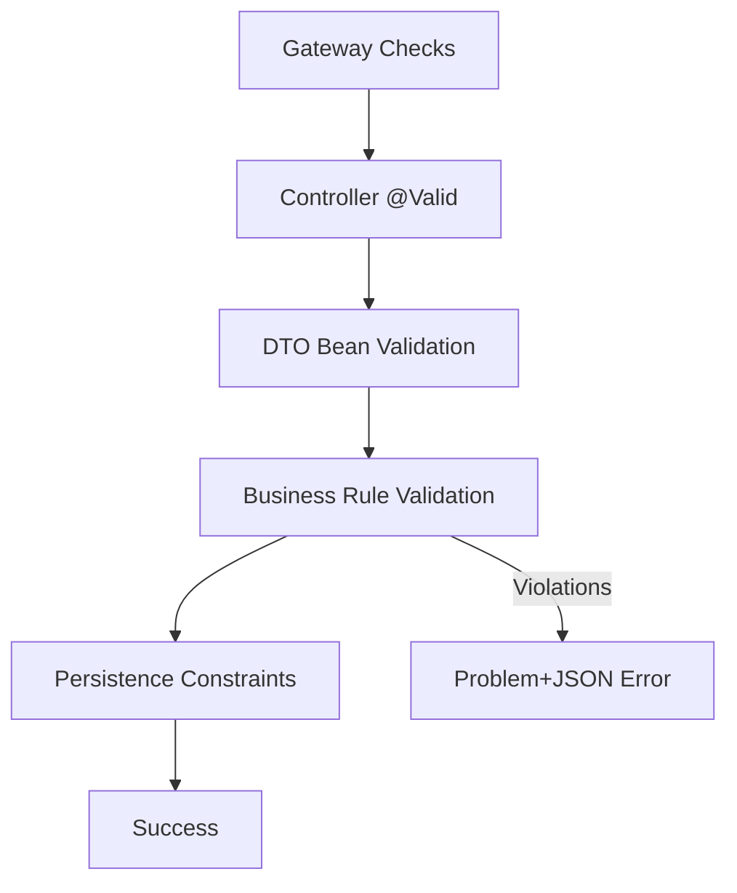

# SEC-07: Input Validation & Sanitization - Interview Guide

**Topic**: Input Validation and Sanitization in Microservices  
**Complexity**: Intermediate to Advanced  
**Interview Duration**: 45-60 minutes  
**Preparation Time**: 2-3 hours

---

## 🎯 Interview Objectives

This guide prepares you to discuss input validation and sanitization implementation in a production microservices environment, covering security, performance, and architectural considerations.

---

## 📋 Core Topics & Questions

### 1. Input Validation Fundamentals

#### **Q: What are the different layers of input validation in a microservices architecture?**

**Structured Answer:**
```
1. API Gateway Layer
   - Request size limits (1MB default)
   - Content type validation
   - Rate limiting (100 req/min per user)
   - Basic format validation

2. Controller Layer (@Valid)
   - Parameter validation
   - Request body validation
   - Path variable validation
   - HTTP method validation

3. DTO Validation Layer (JSR-303/380)
   - Field-level validation (@NotNull, @Size, @Pattern)
   - Custom validation annotations
   - Cross-field validation
   - Nested object validation

4. Business Logic Layer
   - Domain-specific rules
   - Database constraints
   - Cross-service validation
   - Complex business rules

5. Data Access Layer
   - SQL injection prevention
   - Database constraint validation
   - Data integrity checks
```

**Follow-up Discussion:**
- Why validate at multiple layers? (Defense in depth)
- Performance implications of multi-layer validation
- When to fail fast vs. comprehensive validation

### Validation Pipeline Overview



#### **Q: How do you implement Bean Validation (JSR-303/380) in Spring Boot?**

**Technical Implementation:**
```java
// 1. Add dependency
<dependency>
    <groupId>org.springframework.boot</groupId>
    <artifactId>spring-boot-starter-validation</artifactId>
</dependency>

// 2. DTO with validation annotations
public class CreateOrderRequest {
    @NotNull(message = "User ID is required")
    @ValidUUID(message = "Invalid user ID format")
    private UUID userId;
    
    @NotEmpty(message = "Order items are required")
    @Size(min = 1, max = 50, message = "Order must have 1-50 items")
    @Valid // Enables nested validation
    private List<OrderItemRequest> items;
    
    @NotBlank(message = "Shipping address is required")
    @Size(max = 500, message = "Address too long")
    private String shippingAddress;
}

// 3. Controller with @Valid
@PostMapping("/orders")
public ResponseEntity<OrderResponse> createOrder(
    @Valid @RequestBody CreateOrderRequest request) {
    // Implementation
}

// 4. Global exception handler
@RestControllerAdvice
public class ValidationExceptionHandler {
    @ExceptionHandler(MethodArgumentNotValidException.class)
    public ResponseEntity<ErrorResponse> handleValidation(
        MethodArgumentNotValidException ex) {
        
        List<String> errors = ex.getBindingResult()
            .getFieldErrors()
            .stream()
            .map(error -> error.getField() + ": " + error.getDefaultMessage())
            .collect(Collectors.toList());
            
        ErrorResponse response = new ErrorResponse(
            "VALIDATION_ERROR",
            "Request validation failed",
            errors
        );
        
        return ResponseEntity.badRequest().body(response);
    }
}
```

**Key Points:**
- @Valid triggers validation
- @Validated for group validation
- Custom validation messages
- Nested object validation
- Global error handling

### 2. Security & Sanitization

#### **Q: How do you prevent XSS attacks through input validation and sanitization?**

**Security Implementation:**
```java
@Component
public class InputSanitizer {
    private final PolicyFactory policy;
    
    public InputSanitizer() {
        // OWASP HTML Sanitizer policy
        this.policy = Sanitizers.FORMATTING
            .and(Sanitizers.LINKS)
            .and(Sanitizers.BLOCKS);
    }
    
    public String sanitizeHtml(String input) {
        if (input == null) return null;
        
        // Remove potentially dangerous HTML
        String sanitized = policy.sanitize(input);
        
        // Additional custom sanitization
        sanitized = sanitized.replaceAll("<script[^>]*>.*?</script>", "");
        sanitized = sanitized.replaceAll("javascript:", "");
        sanitized = sanitized.replaceAll("on\\w+\\s*=", "");
        
        return sanitized;
    }
    
    // Usage in validation
    @Component
    public class HtmlSanitizationValidator 
        implements ConstraintValidator<SanitizeHtml, String> {
        
        @Autowired
        private InputSanitizer sanitizer;
        
        @Override
        public boolean isValid(String value, ConstraintValidatorContext context) {
            if (value == null) return true;
            
            String sanitized = sanitizer.sanitizeHtml(value);
            return sanitized.equals(value); // Reject if sanitization changed content
        }
    }
}

// Custom annotation
@Target({ElementType.FIELD})
@Retention(RetentionPolicy.RUNTIME)
@Constraint(validatedBy = HtmlSanitizationValidator.class)
public @interface SanitizeHtml {
    String message() default "Input contains potentially dangerous HTML";
    Class<?>[] groups() default {};
    Class<? extends Payload>[] payload() default {};
}
```

**Security Layers:**
1. **Input Sanitization**: Remove/escape dangerous content
2. **Output Encoding**: Encode data when rendering
3. **Content Security Policy**: Browser-level protection
4. **Validation**: Reject suspicious inputs

#### **Q: How do you prevent SQL injection in a JPA/Hibernate environment?**

**Prevention Strategies:**
```java
// 1. Parameterized Queries (JPA Repository - SAFE)
@Repository
public interface OrderRepository extends JpaRepository<Order, UUID> {
    @Query("SELECT o FROM Order o WHERE o.userId = :userId AND o.status = :status")
    List<Order> findByUserIdAndStatus(@Param("userId") UUID userId, 
                                     @Param("status") OrderStatus status);
}

// 2. Criteria API (SAFE)
@Service
public class OrderService {
    public List<Order> searchOrders(String userInput) {
        CriteriaBuilder cb = entityManager.getCriteriaBuilder();
        CriteriaQuery<Order> query = cb.createQuery(Order.class);
        Root<Order> root = query.from(Order.class);
        
        // Safe - uses parameters
        Predicate predicate = cb.like(root.get("description"), 
                                    "%" + userInput + "%");
        query.where(predicate);
        
        return entityManager.createQuery(query).getResultList();
    }
}

// 3. Input Validation for Dynamic Queries
@Component
public class SqlInjectionValidator {
    private static final Pattern SQL_INJECTION_PATTERN = Pattern.compile(
        "(?i)(union|select|insert|update|delete|drop|create|alter|exec|execute|script|javascript|vbscript)"
    );
    
    public boolean isSqlInjectionAttempt(String input) {
        if (input == null) return false;
        return SQL_INJECTION_PATTERN.matcher(input).find();
    }
}

// 4. Custom validation annotation
@Target({ElementType.FIELD, ElementType.PARAMETER})
@Retention(RetentionPolicy.RUNTIME)
@Constraint(validatedBy = NoSqlInjectionValidator.class)
public @interface NoSqlInjection {
    String message() default "Input contains potentially dangerous SQL";
    Class<?>[] groups() default {};
    Class<? extends Payload>[] payload() default {};
}
```

### 3. Custom Validation & Business Rules

#### **Q: How do you implement complex business rule validation that spans multiple fields or services?**

**Implementation Approach:**
```java
// 1. Cross-field validation
@Target({ElementType.TYPE})
@Retention(RetentionPolicy.RUNTIME)
@Constraint(validatedBy = OrderBusinessRulesValidator.class)
public @interface ValidOrderBusinessRules {
    String message() default "Order violates business rules";
    Class<?>[] groups() default {};
    Class<? extends Payload>[] payload() default {};
}

@Component
public class OrderBusinessRulesValidator 
    implements ConstraintValidator<ValidOrderBusinessRules, CreateOrderRequest> {
    
    @Autowired
    private ProductService productService;
    
    @Override
    public boolean isValid(CreateOrderRequest order, ConstraintValidatorContext context) {
        boolean valid = true;
        
        // Rule 1: Order total must be >= $10
        BigDecimal total = calculateTotal(order);
        if (total.compareTo(new BigDecimal("10.00")) < 0) {
            context.buildConstraintViolationWithTemplate(
                "Order total must be at least $10.00")
                .addPropertyNode("items")
                .addConstraintViolation();
            valid = false;
        }
        
        // Rule 2: Maximum 50 items per order
        int totalItems = order.getItems().stream()
            .mapToInt(OrderItemRequest::getQuantity)
            .sum();
        if (totalItems > 50) {
            context.buildConstraintViolationWithTemplate(
                "Order cannot exceed 50 total items")
                .addPropertyNode("items")
                .addConstraintViolation();
            valid = false;
        }
        
        // Rule 3: All products must exist and be available
        for (OrderItemRequest item : order.getItems()) {
            if (!productService.isProductAvailable(item.getProductId(), item.getQuantity())) {
                context.buildConstraintViolationWithTemplate(
                    "Product " + item.getProductId() + " is not available")
                    .addPropertyNode("items")
                    .addConstraintViolation();
                valid = false;
            }
        }
        
        return valid;
    }
    
    private BigDecimal calculateTotal(CreateOrderRequest order) {
        return order.getItems().stream()
            .map(item -> productService.getPrice(item.getProductId())
                .multiply(BigDecimal.valueOf(item.getQuantity())))
            .reduce(BigDecimal.ZERO, BigDecimal::add);
    }
}

// 2. Async validation for expensive checks
@Service
public class AsyncValidationService {
    @Async
    public CompletableFuture<ValidationResult> validateInventoryAsync(UUID productId, int quantity) {
        // Expensive inventory check
        boolean available = inventoryService.checkAvailability(productId, quantity);
        return CompletableFuture.completedFuture(
            new ValidationResult(available, available ? null : "Insufficient inventory")
        );
    }
}
```

### 4. Performance & Scalability

#### **Q: How do you optimize validation performance in high-throughput microservices?**

**Performance Strategies:**
```java
// 1. Validation caching
@Component
public class CachedValidationService {
    @Cacheable(value = "productValidation", key = "#productId")
    public boolean isValidProduct(UUID productId) {
        return productService.exists(productId);
    }
    
    @CacheEvict(value = "productValidation", key = "#productId")
    public void invalidateProductCache(UUID productId) {
        // Called when product is updated/deleted
    }
}

// 2. Batch validation
@Service
public class BatchValidationService {
    public Map<UUID, ValidationResult> validateProductsBatch(List<UUID> productIds) {
        // Single database query for all products
        List<Product> products = productRepository.findAllById(productIds);
        Set<UUID> existingIds = products.stream()
            .map(Product::getId)
            .collect(Collectors.toSet());
            
        return productIds.stream()
            .collect(Collectors.toMap(
                id -> id,
                id -> new ValidationResult(existingIds.contains(id), 
                    existingIds.contains(id) ? null : "Product not found")
            ));
    }
}

// 3. Lazy validation
@Component
public class LazyValidator {
    public ValidationResult validate(CreateOrderRequest request) {
        // Fast validations first
        ValidationResult basicResult = validateBasicFields(request);
        if (!basicResult.isValid()) {
            return basicResult; // Fail fast
        }
        
        // Expensive validations only if basic validation passes
        return validateBusinessRules(request);
    }
}

// 4. Validation metrics
@Component
public class ValidationMetrics {
    private final MeterRegistry meterRegistry;
    private final Timer validationTimer;
    private final Counter validationFailures;
    
    public ValidationMetrics(MeterRegistry meterRegistry) {
        this.meterRegistry = meterRegistry;
        this.validationTimer = Timer.builder("validation.duration")
            .register(meterRegistry);
        this.validationFailures = Counter.builder("validation.failures")
            .register(meterRegistry);
    }
    
    public <T> T timeValidation(Supplier<T> validation) {
        return validationTimer.recordCallable(validation::get);
    }
}
```

**Performance Targets:**
- Validation overhead: < 2ms per request
- Cache hit ratio: > 90% for repeated validations
- Batch validation: 10x faster than individual validation
- Memory usage: < 10MB additional heap per service

### 5. Error Handling & User Experience

#### **Q: How do you design user-friendly validation error responses?**

**Error Response Design:**
```java
// 1. Standardized error response
public class ValidationErrorResponse {
    private String code;
    private String message;
    private String timestamp;
    private String traceId;
    private List<FieldError> fieldErrors;
    private List<GlobalError> globalErrors;
    
    public static class FieldError {
        private String field;
        private Object rejectedValue;
        private String message;
        private String code;
    }
    
    public static class GlobalError {
        private String message;
        private String code;
    }
}

// 2. Comprehensive exception handler
@RestControllerAdvice
public class GlobalValidationExceptionHandler {
    
    @ExceptionHandler(MethodArgumentNotValidException.class)
    public ResponseEntity<ValidationErrorResponse> handleValidation(
        MethodArgumentNotValidException ex, HttpServletRequest request) {
        
        ValidationErrorResponse response = new ValidationErrorResponse();
        response.setCode("VALIDATION_ERROR");
        response.setMessage("Request validation failed");
        response.setTimestamp(Instant.now().toString());
        response.setTraceId(getTraceId(request));
        
        // Field errors
        List<ValidationErrorResponse.FieldError> fieldErrors = ex.getBindingResult()
            .getFieldErrors()
            .stream()
            .map(error -> new ValidationErrorResponse.FieldError(
                error.getField(),
                error.getRejectedValue(),
                error.getDefaultMessage(),
                error.getCode()
            ))
            .collect(Collectors.toList());
        response.setFieldErrors(fieldErrors);
        
        // Global errors
        List<ValidationErrorResponse.GlobalError> globalErrors = ex.getBindingResult()
            .getGlobalErrors()
            .stream()
            .map(error -> new ValidationErrorResponse.GlobalError(
                error.getDefaultMessage(),
                error.getCode()
            ))
            .collect(Collectors.toList());
        response.setGlobalErrors(globalErrors);
        
        return ResponseEntity.badRequest().body(response);
    }
    
    @ExceptionHandler(ConstraintViolationException.class)
    public ResponseEntity<ValidationErrorResponse> handleConstraintViolation(
        ConstraintViolationException ex, HttpServletRequest request) {
        
        ValidationErrorResponse response = new ValidationErrorResponse();
        response.setCode("CONSTRAINT_VIOLATION");
        response.setMessage("Constraint validation failed");
        response.setTimestamp(Instant.now().toString());
        response.setTraceId(getTraceId(request));
        
        List<ValidationErrorResponse.FieldError> fieldErrors = ex.getConstraintViolations()
            .stream()
            .map(violation -> new ValidationErrorResponse.FieldError(
                violation.getPropertyPath().toString(),
                violation.getInvalidValue(),
                violation.getMessage(),
                violation.getConstraintDescriptor().getAnnotation().annotationType().getSimpleName()
            ))
            .collect(Collectors.toList());
        response.setFieldErrors(fieldErrors);
        
        return ResponseEntity.badRequest().body(response);
    }
}

// 3. Internationalization support
@Component
public class ValidationMessageSource {
    @Autowired
    private MessageSource messageSource;
    
    public String getMessage(String code, Object[] args, Locale locale) {
        return messageSource.getMessage(code, args, code, locale);
    }
}

// messages.properties
validation.order.items.required=Order items are required
validation.order.items.size=Order must have {min}-{max} items
validation.order.total.minimum=Order total must be at least ${min}
validation.product.notfound=Product {productId} not found
validation.inventory.insufficient=Insufficient inventory for product {productId}
```

### 6. Monitoring & Observability

#### **Q: How do you monitor and alert on validation failures in production?**

**Monitoring Implementation:**
```java
// 1. Validation metrics
@Component
public class ValidationMetricsCollector {
    private final MeterRegistry meterRegistry;
    
    public ValidationMetricsCollector(MeterRegistry meterRegistry) {
        this.meterRegistry = meterRegistry;
    }
    
    public void recordValidationFailure(String service, String endpoint, String errorType) {
        Counter.builder("validation.failures")
            .tag("service", service)
            .tag("endpoint", endpoint)
            .tag("error.type", errorType)
            .register(meterRegistry)
            .increment();
    }
    
    public void recordValidationDuration(String service, String endpoint, Duration duration) {
        Timer.builder("validation.duration")
            .tag("service", service)
            .tag("endpoint", endpoint)
            .register(meterRegistry)
            .record(duration);
    }
    
    public void recordSuspiciousInput(String service, String inputType, String pattern) {
        Counter.builder("security.suspicious.input")
            .tag("service", service)
            .tag("input.type", inputType)
            .tag("pattern", pattern)
            .register(meterRegistry)
            .increment();
    }
}

// 2. Security event logging
@Component
public class SecurityEventLogger {
    private static final Logger securityLogger = LoggerFactory.getLogger("SECURITY");
    
    public void logSuspiciousInput(String userId, String endpoint, String input, String reason) {
        securityLogger.warn("Suspicious input detected - User: {}, Endpoint: {}, Reason: {}, Input: {}", 
            userId, endpoint, reason, sanitizeForLogging(input));
    }
    
    public void logValidationFailure(String userId, String endpoint, List<String> errors) {
        securityLogger.info("Validation failure - User: {}, Endpoint: {}, Errors: {}", 
            userId, endpoint, errors);
    }
    
    private String sanitizeForLogging(String input) {
        // Remove sensitive data from logs
        return input.replaceAll("(?i)(password|token|key|secret)=[^&\\s]+", "$1=***");
    }
}

// 3. Alert configuration (Prometheus/Grafana)
# Validation failure rate alert
- alert: HighValidationFailureRate
  expr: rate(validation_failures_total[5m]) > 0.1
  for: 2m
  labels:
    severity: warning
  annotations:
    summary: "High validation failure rate detected"
    description: "Validation failure rate is {{ $value }} failures/sec"

# Suspicious input alert
- alert: SuspiciousInputDetected
  expr: rate(security_suspicious_input_total[1m]) > 0
  for: 0m
  labels:
    severity: critical
  annotations:
    summary: "Suspicious input pattern detected"
    description: "Potential security attack detected in {{ $labels.service }}"
```

---

## 🎯 System Design Perspectives

### Distributed Validation Challenges

#### **Challenge 1: Cross-Service Validation**
```
Problem: Order validation needs to check product availability across services
Solution: 
- Async validation with circuit breakers
- Cached validation results
- Eventual consistency with compensation
- Saga pattern for complex validations
```

#### **Challenge 2: Validation Consistency**
```
Problem: Different services have different validation rules
Solution:
- Shared validation library
- API contract testing
- Centralized validation service
- Event-driven validation updates
```

#### **Challenge 3: Performance at Scale**
```
Problem: Validation becomes bottleneck at high throughput
Solution:
- Validation caching strategies
- Batch validation APIs
- Async validation pipelines
- Edge validation (CDN level)
```

### Trade-off Analysis

#### **Security vs Performance**
```
High Security:
+ Comprehensive validation at every layer
+ Real-time cross-service validation
+ Complex business rule validation
- Higher latency (5-10ms overhead)
- Increased resource usage
- More complex error handling

Balanced Approach:
+ Essential security validations
+ Cached validation results
+ Async validation for non-critical rules
+ Acceptable latency (2-3ms overhead)
+ Good user experience

High Performance:
+ Minimal validation overhead
+ Client-side validation reliance
+ Batch validation
- Potential security vulnerabilities
- Data quality issues
- Harder to debug issues
```

#### **Centralized vs Distributed Validation**
```
Centralized Validation Service:
+ Consistent validation rules
+ Single point of maintenance
+ Easier to update rules
- Single point of failure
- Network latency overhead
- Scaling bottleneck

Distributed Validation:
+ Better performance (local validation)
+ No single point of failure
+ Service autonomy
- Rule consistency challenges
- Duplicate validation logic
- Harder to maintain
```

---

## 🚀 Production Considerations

### Deployment Strategy
1. **Blue-Green Deployment**: Validate new validation rules in parallel
2. **Feature Flags**: Gradually roll out new validation rules
3. **Canary Releases**: Test validation changes with subset of traffic
4. **Rollback Plan**: Quick rollback for validation issues

### Operational Excellence
1. **Monitoring**: Comprehensive validation metrics and alerts
2. **Logging**: Structured logging for validation events
3. **Documentation**: Clear validation rule documentation
4. **Testing**: Automated validation testing in CI/CD

### Incident Response
1. **Validation Bypass**: Emergency bypass for critical validation failures
2. **Performance Degradation**: Auto-scaling and circuit breakers
3. **Security Incidents**: Immediate blocking of suspicious patterns
4. **Data Quality Issues**: Compensation transactions and data repair

---

## 💡 Advanced Topics

### Machine Learning Integration
```java
@Component
public class MLValidationService {
    @Autowired
    private AnomalyDetectionService anomalyService;
    
    public ValidationResult validateWithML(CreateOrderRequest request) {
        // Traditional validation first
        ValidationResult basicResult = basicValidator.validate(request);
        if (!basicResult.isValid()) {
            return basicResult;
        }
        
        // ML-based anomaly detection
        double anomalyScore = anomalyService.calculateAnomalyScore(request);
        if (anomalyScore > 0.8) {
            return ValidationResult.failure("Suspicious order pattern detected");
        }
        
        return ValidationResult.success();
    }
}
```

### Event-Driven Validation
```java
@EventListener
public void handleProductUpdated(ProductUpdatedEvent event) {
    // Invalidate validation caches
    validationCacheService.invalidateProduct(event.getProductId());
    
    // Re-validate pending orders
    orderValidationService.revalidatePendingOrders(event.getProductId());
}
```

### GraphQL Validation
```java
@Component
public class GraphQLValidationInstrumentation implements Instrumentation {
    @Override
    public InstrumentationContext<ExecutionResult> beginExecution(
        InstrumentationExecutionParameters parameters) {
        
        // Validate GraphQL query complexity
        QueryComplexityAnalysis analysis = new QueryComplexityAnalysis();
        int complexity = analysis.calculateComplexity(parameters.getQuery());
        
        if (complexity > MAX_QUERY_COMPLEXITY) {
            throw new ValidationException("Query too complex");
        }
        
        return super.beginExecution(parameters);
    }
}
```

---

## 📚 Sample Interview Questions & Answers

### Technical Deep-Dive Questions

**Q: How would you implement rate limiting validation to prevent abuse?**

**A:** I would implement multi-layered rate limiting:

1. **Gateway Level**: Use Spring Cloud Gateway with Redis-based rate limiting
2. **Service Level**: Custom validation annotation with sliding window algorithm
3. **User Level**: JWT-based user identification with per-user limits
4. **IP Level**: IP-based rate limiting for anonymous requests

```java
@Target({ElementType.METHOD})
@Retention(RetentionPolicy.RUNTIME)
public @interface RateLimit {
    int requests() default 100;
    int windowSeconds() default 60;
    String key() default ""; // SpEL expression
}

@Component
public class RateLimitValidator {
    @Autowired
    private RedisTemplate<String, String> redisTemplate;
    
    public boolean isAllowed(String key, int requests, int windowSeconds) {
        String redisKey = "rate_limit:" + key;
        String currentWindow = String.valueOf(System.currentTimeMillis() / (windowSeconds * 1000));
        String redisField = currentWindow;
        
        Long currentCount = redisTemplate.opsForHash().increment(redisKey, redisField, 1);
        redisTemplate.expire(redisKey, Duration.ofSeconds(windowSeconds * 2));
        
        return currentCount <= requests;
    }
}
```

**Q: How do you handle validation in event-driven architectures?**

**A:** Event-driven validation requires special considerations:

1. **Event Schema Validation**: Validate event structure and content
2. **Idempotency Validation**: Prevent duplicate event processing
3. **Ordering Validation**: Ensure events are processed in correct order
4. **Compensation Validation**: Validate compensation events for saga patterns

```java
@Component
public class EventValidator {
    public ValidationResult validateEvent(DomainEvent event) {
        // Schema validation
        if (!isValidEventSchema(event)) {
            return ValidationResult.failure("Invalid event schema");
        }
        
        // Idempotency check
        if (isDuplicateEvent(event.getEventId())) {
            return ValidationResult.failure("Duplicate event");
        }
        
        // Business rule validation
        return validateBusinessRules(event);
    }
    
    @EventListener
    public void handleOrderCreatedEvent(OrderCreatedEvent event) {
        ValidationResult result = validateEvent(event);
        if (!result.isValid()) {
            // Publish validation failure event
            eventPublisher.publishEvent(new ValidationFailedEvent(event, result));
            return;
        }
        
        // Process valid event
        processOrderCreated(event);
    }
}
```

---

## 🎯 Key Takeaways for Interviews

### Technical Expertise Demonstration
1. **Multi-layered Validation**: Show understanding of defense in depth
2. **Performance Optimization**: Discuss caching, batching, and async validation
3. **Security Focus**: Emphasize XSS, injection prevention, and sanitization
4. **Scalability Considerations**: Address high-throughput validation challenges
5. **Monitoring & Observability**: Show production-ready thinking

### Architecture Decision Rationale
1. **Why JSR-303/380**: Standard, annotation-based, Spring integration
2. **Why Global Exception Handler**: Consistent error responses, centralized logic
3. **Why Input Sanitization**: Defense against XSS and injection attacks
4. **Why Validation Caching**: Performance optimization for expensive validations
5. **Why Async Validation**: Non-blocking validation for better user experience

### Production Readiness
1. **Error Handling**: Comprehensive, user-friendly error responses
2. **Monitoring**: Metrics, alerts, and security event logging
3. **Performance**: Optimization strategies and performance targets
4. **Security**: Multiple layers of security validation
5. **Maintainability**: Clean, extensible validation framework

---

**Interview Success Tips:**
- Start with high-level architecture, then dive into implementation details
- Discuss trade-offs and alternative approaches
- Show security awareness and production experience
- Demonstrate understanding of microservices-specific challenges
- Be prepared to code validation examples on the whiteboard
